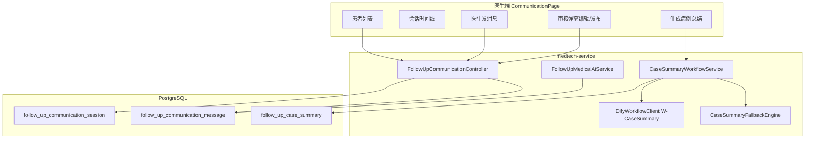

# 医患沟通界面实现计划

## 目标与默认范围

基于你最初设想（P2：医生记录 + 医疗 AI 在医生不在时回复）与当前代码现状：

- **本阶段重点：医生端**（[`/follow-up/communication`](xikang-hospital-frontend/src/app/router/routes.ts) 替换 `RoutePlaceholder`）
- **患者端**：预留 API 与 `shared_to_patient` 发布能力；[`PatientFollowup.vue`](xikang-hospital-frontend/src/modules/patient/pages/PatientFollowup.vue) 增加「医患沟通」Tab 作为 **Phase 1.5**（可本迭代末尾做只读+AI 对话最小版）
- **AI 路线**：与项目一致 — **Dify Workflow（blocking）+ Fallback 模板引擎**；「模型训练/预测」通过工作流编排 LLM + 结构化患者数据实现，独立 ML 训练管线列为后续扩展（可在 Dify 知识库/微调接入）



---

## 一、数据模型（`migrate_019_follow_up_communication.sql`）

新增 3 张表（可重复执行 + 演示种子）：

### 1. `follow_up_communication_session`
| 字段 | 说明 |
|------|------|
| `register_id`, `department_id` | 关联患者与科室 |
| `status` | `active` / `closed` |
| `ai_escalation_enabled` | 医生是否允许 AI 在空闲时代答（默认 true） |
| `doctor_last_active_at` | 判断医生是否在线（如 5 分钟内活跃） |

### 2. `follow_up_communication_message`
| 字段 | 说明 |
|------|------|
| `session_id` | 所属会话 |
| `sender_type` | `doctor` / `patient` / `ai` / `system` |
| `message_type` | `text` / `case_summary` / `notice` |
| `content` | 文本内容 |
| `summary_id` | 关联病例总结（发布时插入一条 summary 卡片消息） |
| `workflow_run_id` | AI 消息溯源 |

### 3. `follow_up_case_summary`（双版本核心）
| 字段 | 说明 |
|------|------|
| `register_id`, `session_id` | 患者与会话 |
| `ai_draft_content` | 工作流原始总结（JSON 或 Markdown） |
| `ai_medical_advice` | 工作流医学建议 |
| `ai_risk_alerts` | JSON 风险点 |
| `doctor_content` | 医生编辑后的定稿 |
| `status` | `draft` → `approved` → `shared`（或 `revoked`） |
| `shared_to_patient` | 是否对患者可见 |
| `workflow_run_id`, `model_id` | 溯源 |
| `approved_by`, `approved_at` | 医生确认信息 |

**演示种子**：为 register 1001–1003 各建 1 个 session、若干历史消息、1 条 `draft` 总结，便于联调。

---

## 二、后端（medtech-service）

参照现有 [`CheckSimulationService`](xikang-cloud-hospital/medtech-service/src/main/java/com/xikang/medtech/ai/CheckSimulationService.java) 与 [`DifyAiProperties`](xikang-cloud-hospital/medtech-service/src/main/java/com/xikang/medtech/ai/DifyAiProperties.java) 扩展：

### 配置（`application.yml`）
```yaml
workflow-follow-up-case-summary: ${DIFY_WORKFLOW_FOLLOW_UP_CASE_SUMMARY:true}
api-key-follow-up-case-summary: ${DIFY_API_KEY_FOLLOW_UP_CASE_SUMMARY:}
workflow-follow-up-medical-chat: ${DIFY_WORKFLOW_FOLLOW_UP_MEDICAL_CHAT:true}
api-key-follow-up-medical-chat: ${DIFY_API_KEY_FOLLOW_UP_MEDICAL_CHAT:}
```

### 新增模块
| 类 | 职责 |
|----|------|
| `FollowUpCommunicationController` | REST `/api/medtech/follow-up/communication/*` |
| `FollowUpCommunicationService` | 会话/消息 CRUD、医生在线状态 |
| `CaseSummaryWorkflowService` | 聚合上下文 → 调 Dify → 落库 draft |
| `CaseSummaryContextBuilder` | 从 DB 组装工作流 inputs |
| `CaseSummaryOutputMapper` | 解析 Dify outputs → 统一契约 |
| `CaseSummaryFallbackEngine` | Dify 不可用时模板生成 |
| `FollowUpMedicalAiService` | 患者消息 → 医疗边界内 AI 回复（非医疗问题拒绝） |

### 工作流 Inputs（`CaseSummaryContextBuilder` 聚合）
复用 [`FollowUpOutcomeMapper.xml`](xikang-cloud-hospital/medtech-service/src/main/resources/mapper/FollowUpOutcomeMapper.xml) 已有查询 + 新增轻量 SQL：

- 患者基本信息、诊断、主诉、过敏史（含 `ai_consultation_record`）
- 近 30 天 [`follow_up_health_metric`](public/follow_up_health_metric.sql) 趋势摘要
- [`ai_follow_up_record`](public/ai_follow_up_record.sql) 症状缓解/副作用
- 今日观察/访谈状态（`follow_up_daily_observation`、`follow_up_day_schedule`）

### 工作流 Outputs（契约）
```json
{
  "caseSummary": "分段病例总结 Markdown",
  "medicalAdvice": "随访与用药建议",
  "riskAlerts": ["..."],
  "followUpFocus": ["..."],
  "confidence": 0.85
}
```

### API 清单
| 方法 | 路径 | 说明 |
|------|------|------|
| GET | `/sessions` | 科室在管患者会话列表（含未读/待回复） |
| POST | `/sessions` | 按 `registerId` 打开/创建会话 |
| GET | `/sessions/{id}/messages` | 分页消息 |
| POST | `/sessions/{id}/messages` | 医生发文字 |
| POST | `/sessions/{id}/patient-messages` | 患者发文字（患者端用，网关鉴权） |
| POST | `/sessions/{id}/ai-reply` | 触发 AI 代答（患者消息后自动或手动） |
| POST | `/case-summary/generate` | 触发工作流，写 `draft` |
| GET | `/case-summary/{registerId}` | 最新总结（含 draft/approved/shared） |
| PUT | `/case-summary/{id}` | 医生保存编辑内容 |
| POST | `/case-summary/{id}/approve` | 定稿 + 可选 `sharedToPatient` |
| POST | `/case-summary/{id}/revoke` | 撤回患者可见 |

**科室过滤**：复用 [`MedtechAuthContext`](xikang-cloud-hospital/medtech-service/src/main/java/com/xikang/medtech/context/MedtechAuthContext.java) 与 Dashboard 一致。

---

## 三、Dify 工作流设计（文档 + 占位）

在 [`task_requirements/设计文档/`](task_requirements/设计文档/) 新增 **`WF-FollowUp_病例总结与医学建议.md`**：

- **W-CaseSummary**：LLM 节点读取结构化 inputs，输出 `caseSummary` + `medicalAdvice` + `riskAlerts`
- **W-MedicalChat**（可选同 App 或独立）：System Prompt 限定「仅回答该患者随访/用药/症状问题，拒绝闲聊与诊断处方」
- 说明后续可在 Dify 接入专科知识库 / 微调模型，无需改前端契约

未配置 API Key 时走 `CaseSummaryFallbackEngine`（规则拼接 + 指标异常提示）。

---

## 四、前端（医生端）

### 路由
[`routes.ts`](xikang-hospital-frontend/src/app/router/routes.ts)：`FollowUpCommunication` → `FollowUpCommunicationPage.vue`

### 页面布局（三栏，与 Dashboard 风格一致）

```
┌─────────────────────────────────────────────────────────┐
│ PageHeader · 医患沟通                    [今日日期][刷新] │
├──────────┬──────────────────────────┬─────────────────┤
│ 患者列表  │ 会话区                    │ 患者摘要侧栏     │
│ 搜索筛选  │ 消息气泡（医/患/AI/总结卡） │ 诊断/指标摘要    │
│ 未读角标  │ 输入框 + 发送             │ [生成病例总结]   │
│          │ AI托管状态条              │ [疗效评估]       │
└──────────┴──────────────────────────┴─────────────────┘
```

### 核心组件（`src/modules/medtech/follow-up/`）
| 组件 | 功能 |
|------|------|
| `FollowUpCommunicationPage.vue` | 主页面编排 |
| `CommunicationPatientList.vue` | 左侧列表（复用 dashboard 患者 + 会话状态） |
| `CommunicationThread.vue` | 消息时间线（区分 doctor/patient/ai/summary 样式） |
| `CommunicationComposer.vue` | 医生输入 |
| `CaseSummaryReviewDialog.vue` | **双版本核心 UI**：左侧 AI 草稿只读 / 右侧可编辑定稿；开关「向患者展示」；确认发布 |
| `CommunicationPatientBrief.vue` | 右侧摘要（诊断、今日状态、最近指标） |

### API 与类型
扩展 [`medtechFollowUp.ts`](xikang-hospital-frontend/src/shared/api/modules/medtechFollowUp.ts) + [`medtechFollowUp.ts` types](xikang-hospital-frontend/src/shared/types/medtechFollowUp.ts)

### 病例总结弹窗交互
1. 医生点「生成 AI 病例总结」→ loading → 打开弹窗展示工作流结果
2. 医生可编辑 `doctor_content`（预填 AI 草稿）
3. 勾选「向患者展示」→ `approve` 后在会话中插入 `case_summary` 类型消息
4. 未勾选则仅医生可见（`approved` 但不 `shared`）

### 深链
支持 `?registerId=` 从工作台/疗效页跳入并自动选中患者（与 [`OutcomeAssessmentPage`](xikang-hospital-frontend/src/modules/medtech/follow-up/pages/OutcomeAssessmentPage.vue) 一致）。

---

## 五、患者端（建议 Phase 1.5，本计划可选项）

在 [`PatientFollowup.vue`](xikang-hospital-frontend/src/modules/patient/pages/PatientFollowup.vue) 增加 Tab「医患沟通」：

- 只读查看 `shared` 病例总结卡片
- 患者发消息 → 若医生离线且 `ai_escalation_enabled`，自动走 `ai-reply`
- 医疗 AI 拒绝非医疗问题（展示统一文案）

若本迭代时间紧，可先完成医生端 + 后端患者 API，患者 Tab 用占位提示「医生发布后可查看」。

---

## 六、联调与验收

1. 执行 `migrate_019` 到云端 DB（与 [`migrate_018`](xikang-cloud-hospital/docker/init-db/migrate_018_follow_up_dashboard.sql) 相同流程）
2. 配置 `DIFY_API_KEY_FOLLOW_UP_CASE_SUMMARY`（或先用 Fallback）
3. medtech01 登录 → `/follow-up/communication` → 选 1001 → 生成总结 → 编辑 → 发布 → 会话出现总结卡
4. 模拟患者消息（API 或患者 Tab）→ AI 仅回答随访相关问题
5. 从工作台带 `registerId` 深链进入

---

## 七、后续可增强（本计划不阻塞 MVP）

- 会话未读数 WebSocket 推送
- 医生「接管会话」一键关闭 AI 托管
- 总结版本历史（v1/v2 diff）
- 将工作流 outputs 写入 `ai_follow_up_record` 形成闭环
- 真实模型训练：导出随访特征集 → 离线训练风险预测模型 → Dify HTTP 节点调用推理服务
