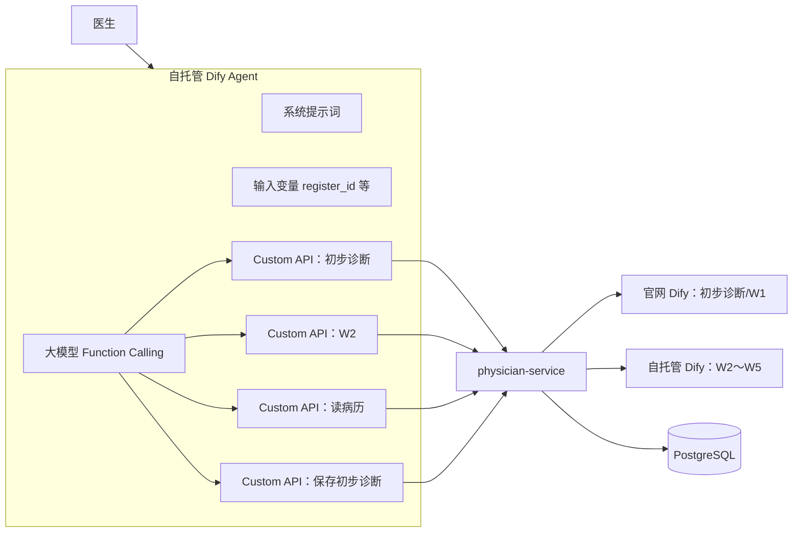
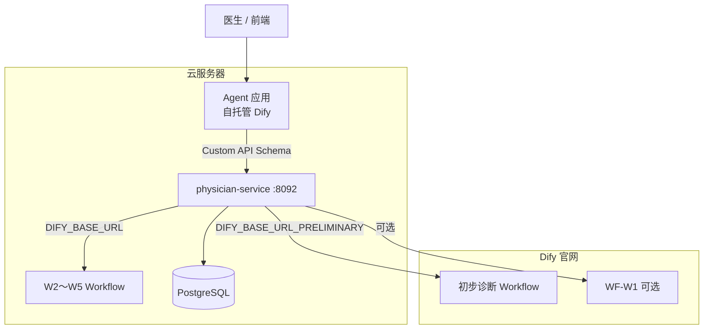

# 门诊临床 Copilot — Dify Agent 编排指南

> **版本**：v2.0  
> **日期**：2026-07-01  
> **读者**：第一次在 Dify 中编排 Agent 的开发者 / 产品  
> **范围**：Dify Agent 编排与联调；含**双 Dify 实例**（官网 + 自托管）与 **physician-service 分阶段部署**说明  
> **关联文档**：  
> - [`xikang-hospital-frontend/src/modules/physician/README.md`](../../xikang-hospital-frontend/src/modules/physician/README.md) — 现有 Workflow API 与 env  
> - [`WF-05_门诊确诊_W4接入实施规格.md`](WF-05_门诊确诊_W4接入实施规格.md)  
> - [`WF-06_智能荐药_W5接入实施规格.md`](WF-06_智能荐药_W5接入实施规格.md)

---

## 1. 你要做的是什么

在 Dify 中新建一个 **Agent 应用**（不是 Workflow），作为门诊「AI 助手」的大脑：

- 医生用自然语言提问（总结病史、解读检验、生成初步诊断、保存病历等）
- Agent **自主决定**是否调用工具（读病历、跑 W2/W3、保存初步诊断等）
- 工具执行结果会回到 Agent 的推理循环（`observation`），形成多步「思考」



**与现有 Spring AI Copilot 的区别**：对话与工具编排全部在 Dify；`physician-service` 负责鉴权、注入 `register_id`、转发 `chat-messages` API，并作为**工具执行网关**（读库、组装 JSON、调用各 Workflow）。

---

## 2. 部署架构：两个 Dify 实例 + physician-service（必读）

你们当前的真实部署情况如下（以 `.env` 为准）：

| 组件 | 部署位置 | 地址示例 | 包含的工作流 |
|------|----------|----------|--------------|
| **官网 Dify** | Dify 云服务 | `https://api.dify.ai` | 初步诊断（知识库）、W1 病历结构化（若在官网创建） |
| **自托管 Dify** | 云服务器 | `http://43.139.102.203` | W2、W3、W4、W5 等 |
| **physician-service** | 云服务器宿主机 JAR | **`http://43.139.102.203:8092`**（规范端口 **8092**） | 无 Dify 工作流；负责调 DB + 转发上述 Workflow |

### 2.0 三个核心结论（直接回答你的疑问）

#### 结论 1：官网 Dify 上「发布为工具」的工作流，**不会**出现在服务器 Dify 里

Dify 的 **Workflow as Tool** 只在**同一个 Dify 工作区**内可见。  
官网账号（`dify.ai`）和自托管实例（`43.139.102.203`）是**两个完全隔离的环境**，工具库、应用、API Key 互不共享。

因此：

- 在官网把 W1 或初步诊断「发布为工具」→ 只有**官网 Dify** 里的 Agent 能挂载；
- 在服务器 Dify 建 Agent → 只能看到**服务器上**发布过的 Workflow 工具。

**不需要**为了「让服务器 Dify 看到官网工具」而把 W1 再部署一遍——正确做法是下面结论 2。

#### 结论 2：跨实例的工作流，一律走 **Custom API → physician-service → Dify Workflow API**

| 工作流 | 所在 Dify | Agent 工具类型 | 说明 |
|--------|-----------|----------------|------|
| 初步诊断 | 官网 | **Custom API** | physician-service 已有 `DIFY_BASE_URL_PRELIMINARY`，由后端代调官网 Workflow |
| W1 病历结构化 | 官网（若在此创建） | **Custom API** 或 Agent MVP 暂跳过 | 同上，经 `POST /api/physician/ai/w1/structure` |
| W2～W5 | 自托管 | **Custom API** | 后端 `runW2`～`runW5` 组装参数后调服务器 Dify |
| 读/写病历 | 无（纯 Java） | **Custom API** | 直接查库 |

**Agent 应用应建在自托管 Dify（`43.139.102.203`）**，与 W2～W5 同实例；官网工作流不迁移、不「发布为工具」，由 physician-service 当桥梁。

> 若将来希望初步诊断也用 Workflow as Tool，需把该 Workflow **导出 DSL 并导入到自托管 Dify**（知识库、模型供应商需一并迁移）。当前阶段**不推荐**，官网知识库在自托管难以 1:1 复现。

#### 结论 3：physician-service **编排期可不上云**，**联调/上线必须部署**

| 阶段 | physician-service 是否必须部署 | 能测什么 |
|------|-------------------------------|----------|
| **纯 Dify 编排**（调提示词、工具描述） | 否 | 用 Mock 或 Dify 内置极简 Workflow 代替 Custom API |
| **Custom API 真联调**（W2、读病历等） | **是**（至少本机 + 网络可达） | Dify 容器需能访问 `8092` |
| **前端 AI 助手接入** | **是**（部署到与 Dify 同网段的服务器） | 完整链路 |

Dify 跑在服务器 Docker 里、physician-service 跑在**同机宿主机**时，Custom Tool 的 `servers.url` **不能填 `localhost` 或 `127.0.0.1`**（指向 Dify 容器自身）。按环境填写：

| 环境 | Schema `servers.url` | 说明 |
|------|----------------------|------|
| 本机开发（Mac/Win Docker Desktop） | `http://host.docker.internal:8092` | Dify 容器访问宿主机上的 physician-service |
| **云服务器上线（推荐）** | `http://172.17.0.1:8092` | Linux Docker 默认网桥访问宿主机；与 W4 HTTP 节点惯例一致 |
| 云服务器备选 | `http://43.139.102.203:8092` | 仅当安全组放行且服务监听 `0.0.0.0:8092` 时可用 |

> **端口规范**：physician-service **固定使用 8092**，与 [`application.yml`](../../xikang-cloud-hospital/physician-service/src/main/resources/application.yml) 及 [`01_系统架构设计文档`](01_系统架构设计文档.md) 一致，**请勿改用其他端口**，否则前端代理、网关路由、Dify Schema 均需同步修改。



---

## 3. 编排前准备

### 3.1 Dify 环境

| 项 | 要求 |
|----|------|
| **Agent 所在实例** | **自托管** `http://43.139.102.203`（与 W2～W5 同实例） |
| Dify 版本 | 建议 **≥ 1.6.0**（支持 MCP；本方案以 Custom OpenAPI 为主） |
| 权限 | 工作区「编辑应用」「创建自定义工具」「访问 API」 |
| 模型 | 在 **设置 → 模型供应商** 中配置 DeepSeek 或等价模型，且支持 **Function Calling / Tool Use** |
| 官网 Dify | 仅托管初步诊断、W1；**不在此建 Agent** |

### 3.2 已有资产清单（请逐项打勾）

| 资产 | Dify 中名称建议 | 开始节点主要输入 | 状态 |
|------|----------------|------------------|------|
| 初步诊断 Workflow | `WF-Prelim 初步诊断` | `text`, `preHandle` | 在**官网** Dify，经 Custom API 调用 |
| W1 病历结构化 | `WF-W1 病历结构化` | 依现有设计 | 在**官网** Dify（若在官网创建），可选 |
| W2 检查推荐 | `WF-W2 检查检验推荐` | `clinical_context_json`, `available_examinations_json` | 在**自托管** Dify |
| W3 结果解读 | `WF-W3 结果解读` | `registerId`, `structuredRecordJson`, `allResultsJson`, `preliminaryAssessment` | 在**自托管** Dify |
| W4 门诊确诊 | `WF-W4 门诊确诊` | 见 WF-05 设计文档 Start 节点 | 在**自托管** Dify |
| W5 智能荐药 | `WF-W6 智能荐药` | 见 WF-06 设计文档 Start 节点 | 在**自托管** Dify |

### 3.3 关键概念（第一次做 Agent 必读）

| 概念 | 说明 |
|------|------|
| **Agent 应用** | 聊天型；模型可**多轮**调用工具 |
| **Workflow 应用** | 固定节点图；适合 W2/W3 等单次任务 |
| **Workflow as Tool** | 把**同一 Dify 实例内**已发布的 Workflow 发布为工具；**不能跨官网与自托管** |
| **Custom Tool** | 用 OpenAPI / HTTP 调外部 API（如 physician-service） |
| **inputs** | Agent 应用级变量，每次对话由**调用方**传入（如 `register_id`） |
| **query** | 用户当轮说的话 |
| **conversation_id** | Dify 侧多轮会话 ID，对应你们前端的「对话线程」 |
| **agent_thought** | 流式事件，含 `thought`、`tool`、`observation`，可展示「正在调用 xxx」 |

---

## 4. 工具策略总览（非常重要）

结合第 2 节的双 Dify 架构，工具分两类：

### 类型 A：参数简单、且 Workflow 在**自托管 Dify** 上（可选 Workflow as Tool）

| 工具 | 说明 |
|------|------|
| （无，当前无符合项） | 初步诊断、W1 在官网，**不要**用 Workflow as Tool |

### 类型 B：走 physician-service Custom API（本方案默认）

| 工具 | 原因 |
|------|------|
| **初步诊断** | Workflow 在官网 Dify；后端已有 `DIFY_BASE_URL_PRELIMINARY` |
| W1 | 若在官网创建，同上 |
| W2～W5 | 需后端从 DB 组装复杂 JSON |
| 读病历 / 保存病历 | 需鉴权、`registerId`、写库 |

**推荐做法**：

1. 在**自托管 Dify** 建 Agent 应用。  
2. 所有工具统一建 **Custom API**（OpenAPI Schema，见第 6.2 节完整示例）。  
3. **编排期**：physician-service 跑在本机 **8092**，Schema 里 `servers.url` 用 `host.docker.internal:8092`；未就绪时用 Mock。  
4. **上线期**：physician-service 部署至云服务器 **8092**，Schema 改为 `http://172.17.0.1:8092`（见 8.4）。

---

## 5. 创建 Agent 应用（逐步操作）

### 5.1 新建应用

1. 登录 **自托管 Dify**（`http://43.139.102.203`）→ **工作室** → **创建应用**
2. 类型选择：**Agent**（或「智能助手 / Agent」，以你界面文案为准）  
3. 名称：`门诊临床 Copilot`（或 `Clinical Copilot Agent`）  
4. 图标 / 描述：自行填写  

### 5.2 选择模型与 Agent 模式

进入应用 → **Agent 设置**（或「编排」页右侧模型区）：

| 配置项 | 建议 |
|--------|------|
| 模型 | DeepSeek-Chat / DeepSeek-V3 等你们已在用的模型 |
| Agent 模式 | 若可选 **Function Calling**，优先选它；否则 **ReAct** |
| 温度 | `0.3`～`0.5`（临床场景偏低，减少胡编） |
| 最大迭代次数 | `5`～`8`（限制工具调用轮数，防止死循环） |

### 5.3 定义应用输入变量（Variables）

在 **「变量」/「开始」** 区域新增以下变量（类型均为 **String**，除非注明）：

| 变量名 | 类型 | 必填 | 说明 | 谁赋值 |
|--------|------|------|------|--------|
| `register_id` | String | 是 | 就诊号 | 后续由 physician-service 每次 `chat-messages` 传入 |
| `clinical_context_text` | String | 否 | 病历+预问诊拼好的文本，供初步诊断等 | 后端组装后传入 |
| `clinical_context_json` | String | 否 | W2 用临床上下文 JSON 字符串 | 后端组装 |
| `patient_name` | String | 否 | 患者姓名（展示用） | 后端 |
| `visit_state` | String | 否 | 就诊状态码或中文 | 后端 |
| `doctor_id` | String | 否 | 当前医生 employeeId | 后端注入，工具请求体 Fixed 绑定 |
| `session_id` | String | 否 | Copilot 会话 ID | 后端注入，工具请求体 Fixed 绑定 |

编排期在 **「调试与预览」** 里可手动填写测试值，例如：

```text
register_id: 10001
clinical_context_text: |
  主诉：头痛伴智力减退多年
  现病史：常年头痛，生活不能自理，在家休养
  既往史：无特殊
  过敏史：无
  体格检查：需人照顾
patient_name: 张三
visit_state: 接诊中
```

### 5.4 系统提示词（Instructions）

将下面整段粘贴到 **「指令 / 系统提示词」** 中，并按需微调：

```markdown
你是东软云医院「门诊临床 Copilot」，协助**医生**处理当前患者。你的输出对象是医生，不是患者。

## 角色与边界
- 基于下方「会话输入变量」与工具返回结果作答；信息不足时明确说明，不得捏造检验数值或未提供的诊断。
- 你是辅助决策，**不能替代医生确诊**；涉及保存、开检查、确诊、开药时，须说明「供医生审核」。
- 回答使用简体中文，条理清晰，必要时用小标题和列表。

## 会话输入（由系统注入，勿向医生索要 register_id）
- 就诊号 register_id：{{register_id}}
- 患者：{{patient_name}}，就诊状态：{{visit_state}}
- 病历与预问诊摘要：
{{clinical_context_text}}

## 工具使用原则
1. **先读后写**：修改或保存病历前，先调用 `tool_get_medical_record` 确认当前内容。
2. **工作流类**（run_w*）：仅在医生明确要求时调用。
3. **草案类**（draft_*）：可主动调用，**不写库**。返回的 `confirmPayload` 用于生成确认卡片。
4. **提交类**（commit_* / save_*）：**禁止**在 Dify 内直接调用（没有 confirmation_token 会失败）。写库由医生在前端点击确认卡完成。
5. 医生口头说「确认」≠ 可以 commit；必须输出下方 `confirm` 块或依赖前端从 draft 结果自动生成确认卡。
6. 若工具返回错误，如实转述并给出可操作建议。

## 保存病历的标准流程（重要）
当医生说「补充预问诊到病历」「更新病历」时：

**步骤 1** — 调用 draft 工具（二选一）：
- 推荐：`tool_draft_medical_record`，请求体设 `merge_from_preconsultation: true`（自动合并预问诊过敏史、既往史等）
- 或手动传字段：`allergy`、`history`、`present` 等

**步骤 2** — 根据 observation 中的 `diff` 和 `confirmPayload` 向医生说明将改什么。

**步骤 3** — 在回复末尾输出确认块（前端会出现「保存病历」卡片）：

```confirm
{
  "type": "commit_medical_record",
  "label": "保存病历",
  "description": "将预问诊信息补充到病历",
  "reason": "医生已确认",
  "payload": {
    "allergy": "头孢过敏，无其他过敏史",
    "history": "高血压病史，未规律服药"
  }
}
```

`payload` 必须与 observation 里的 `confirmPayload` 一致（可精简为仅变更字段）。

## 典型任务映射
| 医生意图 | 建议工具 |
|----------|----------|
| 补充预问诊到病历 | `tool_draft_medical_record` + `merge_from_preconsultation: true` → 输出 confirm 块 |
| 补全并保存病历（指定字段） | `tool_draft_medical_record`（传 allergy/history 等）→ confirm 块 |
| 开检查/检验 | `tool_draft_order_basket`（可 `use_w2: true`）→ confirm 块 |
| 保存确诊/处方 | 对应 `tool_draft_*` → confirm 块 |

## 禁止事项
- 禁止调用 `tool_commit_*` / `tool_save_*`（除非已有 confirmation_token，通常不会有）
- 禁止在回复中输出 `<think>` 等思考过程
- 禁止声称「已保存」——只有医生点击确认卡后才算保存

## 回复结构建议
- 临床问答：结论 → 依据 → 待补充信息
- draft 执行后：变更摘要（表格）→ 说明「请在下方确认卡中提交」
```

> **说明**：`{{register_id}}` 等写法依赖 Dify 变量插值；若界面不支持，可改成「见上方变量面板」。

---

## 6. 工具配置详解

### 6.1 工具一览表

| 工具 ID 建议 | 类型 | 用途 | 编排阶段 |
|--------------|------|------|----------|
| `tool_run_preliminary_diagnosis` | Custom API | 跑初步诊断（官网 Dify） | 本节 6.2 |
| `tool_run_w1` | Custom API | 病历结构化（可选，官网 W1） | 本节 6.2 |
| `tool_run_w2` | Custom API | 检查推荐 | 本节 6.3 |
| `tool_run_w3` | Custom API | 结果解读 | 同上 |
| `tool_run_w4` | Custom API | 门诊确诊 | 同上 |
| `tool_run_w5` | Custom API | 智能荐药 | 同上 |
| `tool_get_medical_record` | Custom API | 读病历 | 第 8 节 |
| `tool_get_lab_results` | Custom API | 读检查检验结果 | 第 8 节 |
| `tool_save_preliminary_diagnosis` | Custom API | 保存初步诊断（需 token） | 第 15 节 |
| 读/草案/提交扩展工具 | Custom API | 见 WF-AGENT_openapi_v2.yaml | 第 15 节 |

---

### 6.2 Schema 填什么？（创建自定义工具对话框）

你在 Dify 里点 **「创建自定义工具」** 时，大文本框要填的是 **OpenAPI 3.0 规范**（YAML 或 JSON），描述 physician-service 暴露的 HTTP 接口。Dify 会据此解析出「可用工具」表格里的每一行（名称、方法、路径）。

#### 6.2.1 对话框各区域对应关系

| 界面区域 | 填什么 |
|----------|--------|
| **名称** | 工具集名称，如 `东软云医院-门诊 Agent 工具` |
| **Schema 文本框** | 整份 OpenAPI YAML（见 6.2.2，**直接复制粘贴**） |
| **可用工具**（自动解析） | 保存 Schema 后出现多行：`tool_run_w2`、`tool_get_medical_record` 等 |
| **鉴权方法** | 编排期选「无」；上线后在齿轮里配 **API Key**，Header 名 `Authorization`，值 `Bearer <内部 Token>`（与 `INTERNAL_AI_TOKEN` 一致，仅 Dify→后端） |
| **Server URL** | 写在 Schema 的 `servers[0].url`，见下方说明 |

#### 6.2.2 完整 Schema 示例（可直接粘贴）

将 `servers.url` 改成你当前环境 Dify **能访问到**的 physician-service 地址：

```yaml
openapi: 3.0.0
info:
  title: Xikang Physician Agent Tools
  description: 门诊临床 Copilot 工具网关，由 physician-service 实现
  version: 0.1.0
servers:
  # 云服务器上线（Dify Docker + physician-service 宿主机 JAR，同机）：
  - url: http://172.17.0.1:8092
  # 本机开发（Dify 在 Docker Desktop 内）：
  # - url: http://host.docker.internal:8092
paths:
  /api/physician/agent/tools/run-preliminary-diagnosis:
    post:
      operationId: tool_run_preliminary_diagnosis
      summary: 为当前就诊运行 AI 初步诊断
      description: 读取病历与预问诊，调用官网 Dify 初步诊断工作流。仅在医生要求生成/更新初步诊断时使用。
      requestBody:
        required: true
        content:
          application/json:
            schema:
              type: object
              required: [register_id]
              properties:
                register_id:
                  type: string
                  description: 就诊号
      responses:
        '200':
          description: 初步诊断结果 JSON（含 primaryDiagnosis、clinicalSummary 等）

  /api/physician/agent/tools/run-w1:
    post:
      operationId: tool_run_w1
      summary: 病历结构化（W1）
      description: 将长文本或表单内容结构化为标准病历字段。可选工具，Agent MVP 可不挂载。
      requestBody:
        required: true
        content:
          application/json:
            schema:
              type: object
              required: [register_id]
              properties:
                register_id:
                  type: string
      responses:
        '200':
          description: W1 结构化字段 JSON

  /api/physician/agent/tools/run-w2:
    post:
      operationId: tool_run_w2
      summary: 为当前就诊运行 W2 检查检验推荐
      description: 根据病历与初步诊断推荐检查检验项目。需要 register_id。
      requestBody:
        required: true
        content:
          application/json:
            schema:
              type: object
              required: [register_id]
              properties:
                register_id:
                  type: string
      responses:
        '200':
          description: W2 结果 JSON

  /api/physician/agent/tools/run-w3:
    post:
      operationId: tool_run_w3
      summary: 解读检查与检验结果（W3）
      requestBody:
        required: true
        content:
          application/json:
            schema:
              type: object
              required: [register_id]
              properties:
                register_id:
                  type: string
      responses:
        '200':
          description: W3 结果 JSON

  /api/physician/agent/tools/run-w4:
    post:
      operationId: tool_run_w4
      summary: 门诊确诊推荐（W4）
      requestBody:
        required: true
        content:
          application/json:
            schema:
              type: object
              required: [register_id]
              properties:
                register_id:
                  type: string
      responses:
        '200':
          description: W4 结果 JSON

  /api/physician/agent/tools/run-w5:
    post:
      operationId: tool_run_w5
      summary: 智能荐药（W5）
      description: 需已有门诊确诊结果。
      requestBody:
        required: true
        content:
          application/json:
            schema:
              type: object
              required: [register_id]
              properties:
                register_id:
                  type: string
      responses:
        '200':
          description: W5 结果 JSON

  /api/physician/agent/tools/get-medical-record:
    post:
      operationId: tool_get_medical_record
      summary: 获取当前就诊的病历全文
      description: 读取主诉、现病史、既往史、过敏史、体格检查、初步诊断等。回答病情或保存前应先调用。
      requestBody:
        required: true
        content:
          application/json:
            schema:
              type: object
              required: [register_id]
              properties:
                register_id:
                  type: string
      responses:
        '200':
          description: 病历 JSON

  /api/physician/agent/tools/get-lab-results:
    post:
      operationId: tool_get_lab_results
      summary: 获取检查与检验结果列表
      requestBody:
        required: true
        content:
          application/json:
            schema:
              type: object
              required: [register_id]
              properties:
                register_id:
                  type: string
      responses:
        '200':
          description: 结果列表 JSON

  /api/physician/agent/tools/save-preliminary-diagnosis:
    post:
      operationId: tool_save_preliminary_diagnosis
      summary: 将医生确认的初步诊断写入病历
      description: 仅在医生明确同意保存时调用。
      requestBody:
        required: true
        content:
          application/json:
            schema:
              type: object
              required: [register_id, preliminary_diagnosis]
              properties:
                register_id:
                  type: string
                preliminary_diagnosis:
                  type: string
                  description: 医生确认的初步诊断文本
                disease_ids:
                  type: array
                  items:
                    type: integer
                  description: 可选，疾病库 ID 列表
      responses:
        '200':
          description: 保存结果
```

粘贴后点击保存，**「可用工具」** 表格应出现 9 个 operation。若为空，检查 YAML 缩进或 `openapi: 3.0.0` 版本号。

#### 6.2.3 在 Agent 中挂载与参数绑定

1. 打开 **门诊临床 Copilot** Agent（建在**自托管 Dify**）→ **添加工具** → 选择刚创建的自定义工具集。  
2. 勾选需要的 operation（MVP 至少：`tool_run_preliminary_diagnosis`、`tool_get_medical_record`、`tool_save_preliminary_diagnosis`）。  
3. 每个工具的 `register_id` 请求体字段设为 **Fixed**，值 `{{register_id}}`。  
4. `tool_save_preliminary_diagnosis` 的 `preliminary_diagnosis` 保持 **Auto**（由模型从对话提取医生确认文本）。

#### 6.2.4 调试话术示例

```text
请根据当前病历运行初步诊断，并总结主要诊断建议。
```

预期：Agent 调用 `tool_run_preliminary_diagnosis` → `observation` 中含 JSON → 回复归纳 `primaryDiagnosis` 等字段。

> **说明**：上述 `/api/physician/agent/tools/*` 路径为 Agent 专用网关（第 8 节），与现有 `POST /api/physician/ai/w2/recommend` 等页面 API 并存；网关内部复用同一套 `pipelineService` 逻辑。

---

### 6.3 工具：W2 / W3 / W4 / W5 及读写信令（已含于 6.2.2 Schema）

W2～W5 在自托管 Dify 上，但 Agent **仍不应**直接「Publish as Tool」调用裸 Workflow——参数组装依赖 DB，必须由 physician-service 完成。

若 6.2.2 的合并 Schema 已导入，**无需再单独建工具**；仅需在 Agent 里勾选对应 operation。

#### 6.3.1 编排期没有后端 API 时怎么测

任选其一：

- **方案 1**：在 Dify 再建一个 **极简 Workflow 工具** 返回固定 JSON，名称仍叫 `tool_run_w2`，仅用于验证 Agent 是否会「先问再调工具」。  
- **方案 2**：用 [Mockoon](https://mockoon.com/) 等在本机 `8092` 端口 Mock 上述路径。  
- **方案 3**：暂时不挂 W2～W5，只联调 **初步诊断 + 读病历 Mock**，Agent 提示词里删掉对应行。

---

### 6.4 在 Agent 中挂载全部工具

1. Agent 应用（**自托管 Dify**）→ **工具** → **添加** → 选择 6.2 创建的自定义工具集  
2. 勾选需要的 operation（见 6.2.3）  
3. 检查每个工具的 **描述** 是否清晰（模型主要靠描述决定何时调用）  
4. 保存应用 → **发布**  

---

## 7. MCP 要不要配？

| 方式 | 何时用 |
|------|--------|
| **不用 MCP**（本指南默认） | Custom OpenAPI 工具已足够 |
| **用 MCP** | 工具很多、多环境复用、或希望用标准协议给 Cursor 等共用 |

若坚持用 MCP：

1. Dify → **工具** → **MCP** → **添加 MCP Server（HTTP）**  
2. Server URL 指向你们将来部署的 `physician-agent-mcp`（由 physician-service 或独立进程提供）  
3. **Server ID** 固定为 `xikang-physician`，勿随意改  
4. Agent 里勾选该 Server 下的工具  

**编排第一阶段建议跳过 MCP**，减少概念负担；等 Custom API 稳定后再包一层 MCP 亦可。

---

## 8. 与 physician-service 的对接约定

### 8.0 部署时机（分三阶段）

| 阶段 | 你要做的事 | physician-service |
|------|-----------|-------------------|
| **① Dify 编排** | 在自托管 Dify 建 Agent、贴 Schema、调提示词 | 可不部署；Custom Tool 用 Mockoon 或暂不勾选 W2～W5 |
| **② 工具联调** | 本机 `mvn spring-boot:run` 起 8092，Schema 改 `host.docker.internal:8092` | **本机运行**，需能连远程 DB（`spring.profiles.active=remote`） |
| **③ 上线** | physician-service JAR 部署到云服务器 **8092**；Schema 改 `172.17.0.1:8092`；前端走 Copilot Chat API | **必须部署**，见 8.4 |

W1、初步诊断 **无需**迁移到自托管 Dify；physician-service 通过 `DIFY_BASE_URL_PRELIMINARY` 继续调官网即可。

### 8.1 调用方式

后端将用 Dify **Chat API**（不是 Workflow API）：

```http
POST {DIFY_BASE_URL}/v1/chat-messages
Authorization: Bearer {DIFY_AGENT_API_KEY}
Content-Type: application/json

{
  "inputs": {
    "register_id": "10001",
    "clinical_context_text": "主诉：...",
    "patient_name": "张三",
    "visit_state": "接诊中"
  },
  "query": "帮我生成初步诊断并保存",
  "response_mode": "streaming",
  "user": "doctor-{doctorId}-reg-{registerId}",
  "conversation_id": "{difyConversationId 或空}"
}
```

| 字段 | 映射 |
|------|------|
| `conversation_id` | 与前端「对话线程 / session」一一对应，首次为空由 Dify 返回 |
| `user` | 建议含 doctorId + registerId，便于审计 |
| `inputs.*` | 与 Agent 变量名一致 |

### 8.2 建议新增的 Agent 网关 API（工具的真实实现）

| 路径 | 作用 | 内部调用 |
|------|------|----------|
| `POST /api/physician/agent/tools/run-preliminary-diagnosis` | 初步诊断 | 读病历 → `pipelineService.runPreliminaryDiagnosis`（调官网 Dify） |
| `POST /api/physician/agent/tools/run-w1` | W1 结构化 | `pipelineService` / 现有 W1 接口 |
| `POST /api/physician/agent/tools/run-w2` | W2 | `pipelineService.runW2(registerId)` |
| `POST /api/physician/agent/tools/run-w3` | W3 | `pipelineService.runW3(registerId)` |
| `POST /api/physician/agent/tools/run-w4` | W4 | `pipelineService.runW4(registerId)` |
| `POST /api/physician/agent/tools/run-w5` | W5 | `pipelineService.runW5(registerId)` |
| `POST /api/physician/agent/tools/get-medical-record` | 读病历 | `physicianService.getMedicalRecord` |
| `POST /api/physician/agent/tools/get-lab-results` | 读结果 | check + inspection |
| `POST /api/physician/agent/tools/save-preliminary-diagnosis` | 保存初步诊断 | `savePreliminaryDiagnosis` |

所有接口：

- 校验当前医生对 `register_id` 有权限  
- 返回 JSON 字符串友好结构，供 Dify Tool 解析  
- 写操作记审计日志  

### 8.3 环境变量（接入时）

```bash
# Agent 应用专用（与 Workflow 的 app-xxx 不同；在自托管 Dify 控制台复制）
DIFY_AGENT_API_KEY=app-xxxxxxxx
DIFY_AGENT_BASE_URL=http://43.139.102.203   # 自托管根地址，勿带 /v1

# 以下已有，Agent 网关内部继续复用
DIFY_BASE_URL=http://43.139.102.203
DIFY_BASE_URL_PRELIMINARY=https://api.dify.ai
DIFY_API_KEY_PRELIMINARY=app-xxx
```

### 8.4 physician-service 服务器部署规范（端口 8092）

#### 8.4.1 端口是否有要求？

**有，且已全局约定：固定 `8092`。**

| 项 | 规范值 | 配置位置 |
|----|--------|----------|
| HTTP 端口 | **8092** | `physician-service/src/main/resources/application.yml` → `server.port: 8092` |
| 服务名 | `physician-service` | Nacos / 日志 / 网关路由标识 |
| 同机其他服务 | 8091 挂号、8093 医技、8094 药房、8098 ai-catalog | 勿占用 8092 |

部署时**不要**通过 `-Dserver.port=xxxx` 或环境变量改端口，除非同步更新下文所有引用。

#### 8.4.2 推荐部署方式（与现有 W4 实践一致）

```text
云服务器 43.139.102.203
├── Docker：Dify（自托管，Agent + W2～W5）
├── 宿主机 JAR：physician-service 监听 0.0.0.0:8092
├── 目录：/www/wwwroot/cz/xikang/（JAR + .env 同目录）
└── PostgreSQL：同机或远程 5432
```

**启动示例：**

```bash
cd /www/wwwroot/cz/xikang
# .env 含 DIFY_*、DB_*、DEEPSEEK_* 等
java -jar physician-service-*.jar --spring.profiles.active=remote
```

验证：

```bash
curl -s -o /dev/null -w "%{http_code}" http://127.0.0.1:8092/actuator/health
# 或未配 actuator 时：
curl -s -o /dev/null -w "%{http_code}" http://127.0.0.1:8092/api/physician/...
```

#### 8.4.3 Dify Custom Tool 与防火墙

| 访问方 | 目标地址 | 是否需公网暴露 8092 |
|--------|----------|---------------------|
| Dify 容器（同机） | `http://172.17.0.1:8092` | **否**（仅 Docker 网桥 → 宿主机） |
| 前端 / 网关（经 Nginx 反代） | `https://域名/api/physician/...` | 由网关统一入口，**不必**对公网直接开放 8092 |
| 本机开发 | `http://localhost:8092` | 仅本机 |

**安全组建议**：云服务器安全组**不要**对 `0.0.0.0/0` 放行 8092；Agent 工具调用走 Docker 内部 `172.17.0.1` 即可。若必须用公网 IP 联调，限源 IP 并配合 `INTERNAL_AI_TOKEN` 鉴权。

#### 8.4.4 部署后必改的两处配置

1. **Dify 自定义工具 Schema**：`servers.url` → `http://172.17.0.1:8092`（见 6.2.2）  
2. **`.env`（与 JAR 同目录）**：确认 `DIFY_BASE_URL=http://43.139.102.203`、各 Workflow API Key、数据库连接可用  

#### 8.4.5 Agent 工具鉴权（上线时）

Dify Custom Tool 的 **鉴权** 建议配置：

| 项 | 值 |
|----|-----|
| 类型 | API Key |
| Header | `Authorization` |
| 值 | `Bearer ${INTERNAL_AI_TOKEN}`（与 `.env` 中 `INTERNAL_AI_TOKEN` 一致） |

physician-service 侧需在 Agent 网关接口校验该 Token（实现 8.2 时一并加入），避免 8092 被同网段误调用。

---

## 9. 调试与验收

### 9.1 Dify 控制台内调试

在 Agent **预览 / 调试** 面板：

1. 填好 `register_id`、`clinical_context_text`  
2. 依次测试下表用例  

| # | 用户输入 | 预期 Agent 行为 |
|---|----------|-----------------|
| T1 | 总结主诉和现病史 | 不调工具，基于 `clinical_context_text` 回答 |
| T2 | 帮我生成初步诊断 | 调用 `tool_run_preliminary_diagnosis`，归纳结果 |
| T3 | 把刚才的初步诊断保存到病历 | 先确认诊断文本 → 调用 `tool_save_preliminary_diagnosis`（API 通时） |
| T4 | 推荐需要做什么检查 | 调用 `tool_run_w2`（API 通时） |
| T5 | 解读检验结果 | 若有结果则 `tool_run_w3` 或 `tool_get_lab_results` + 回答 |
| T6 | 帮我补全病历并保存 | `tool_draft_medical_record` → 回复含 ```confirm``` 卡片 |
| T7 | 按 W2 推荐开检查 | `tool_draft_order_basket`（use_w2=true）→ ```confirm``` |
| T8 | 给出确诊和处方方案 | `tool_draft_diagnosis` + `tool_draft_prescription` → ```confirm``` |

### 9.2 查看 Agent 是否真的在「思考」

发布为 API 后，流式响应含 `agent_thought` 事件，字段示例：

```json
{
  "event": "agent_thought",
  "thought": "医生需要初步诊断，应调用初步诊断工具",
  "tool": "tool_run_preliminary_diagnosis",
  "tool_input": "{\"text\":\"...\",\"preHandle\":true}",
  "observation": "{ ... 工作流输出 JSON ... }"
}
```

编排期在 Dify 调试界面也应能看到 **工具调用记录**。

### 9.3 常见问题

| 现象 | 原因 | 处理 |
|------|------|------|
| 官网发布的工具在服务器 Dify 找不到 | 两个 Dify 实例隔离 | 不要迁移 W1；用 Custom API + physician-service（第 2 节） |
| Schema 粘贴后「可用工具」为空 | YAML 缩进错误或缺 `openapi: 3.0.0` | 用 6.2.2 整段复制；检查 `paths` 下缩进 |
| Custom Tool 调用超时 / Connection refused | Dify 容器访问不到宿主机 8092 | 云服务器用 `172.17.0.1:8092`；本机用 `host.docker.internal:8092` |
| 端口被占用导致启动失败 | 8092 已被其他进程占用 | `lsof -i :8092` 排查；**不要改端口**，释放占用进程 |
| Agent 从不调工具 | 工具描述模糊 / 模型不支持 Function Calling | 加强描述；换模型 |
| 重复让用户点「运行初步诊断」 | 未把 observation 当依据；提示词未写「工具成功后勿重复」 | 改系统提示词 |
| W2 工具失败 | Dify 直连裸 W2 Workflow，缺 JSON | 必须用 Custom API `run-w2` |
| 保存后病历没变化 | Agent 网关 API 未实现 | 先实现 8.2 路径后再测 |
| 初步诊断工具 500 | physician-service 未起或 `DIFY_API_KEY_PRELIMINARY` 未配 | 本机起 8092 并检查 `.env` |

---

## 10. 发布 Agent 应用

1. Agent 编排完成 → 右上角 **发布**  
2. **访问 API** → 复制 **API Key**（`app-xxx`）→ 记入 `DIFY_AGENT_API_KEY`  
3. 记录 **API 文档** 中的 `POST /chat-messages` 地址  
4. （可选）**发布为 MCP Server**：供其他客户端调用；门诊前端仍建议走 physician-service 代理  

---

## 11. 编排完成检查清单

### 11.1 Dify 内

- [ ] Agent 应用已在**自托管 Dify** 创建，模型与 Agent 模式已选  
- [ ] 输入变量：`register_id`、`clinical_context_text` 等已建  
- [ ] 系统提示词已粘贴并含工具使用原则  
- [ ] 已创建自定义工具并粘贴 6.2.2 完整 OpenAPI Schema  
- [ ] 「可用工具」表格已解析出 9 个 operation  
- [ ] 所需 operation 已挂载到 Agent；`register_id` 设为 Fixed `{{register_id}}`  
- [ ] T1～T3 调试用例通过（联调期需 physician-service 可达）  
- [ ] Agent 已发布，API Key 已记录  

### 11.2 进入代码 / 部署阶段前交给后端的信息

- [ ] Agent API Key、Base URL（自托管）  
- [ ] Agent 输入变量完整列表  
- [ ] 6.2.2 OpenAPI Schema（或从 Dify 导出）  
- [ ] physician-service 已部署至云服务器 **8092**，健康检查通过  
- [ ] Dify Schema `servers.url` 已改为 `http://172.17.0.1:8092`  
- [ ] 安全组未对公网开放 8092（或已配 Token 鉴权）  
- [ ] 期望的流式事件（是否要展示 `agent_thought`）  

---

## 12. 附录 A：初步诊断为何走 Custom API 而非 Workflow as Tool

| 对比项 | Workflow as Tool | Custom API（本方案） |
|--------|------------------|----------------------|
| 适用 Dify | 必须与 Agent **同一实例** | 任意；后端可调官网 + 自托管 |
| 你们现状 | 初步诊断在官网，Agent 在自托管 | ✅ 匹配 |
| 病历文本来源 | 需 Agent 变量 `clinical_context_text` 有值 | 后端自动读 DB + 预问诊 |
| 知识库 | 留在官网 | 不变 |

网关内部仍调用 `POST {DIFY_BASE_URL_PRELIMINARY}/v1/workflows/run`，与门诊第 2 步页面逻辑一致。

Workflow 输出（`observation` 关键字段）：

| 字段 | 含义 |
|------|------|
| `clinicalSummary` | 临床摘要 |
| `primaryDiagnosis` | 首要初步诊断 |
| `diseaseDetail` / `suggestedDiseases` | 建议疾病列表 |
| `redFlags` | 红旗征 |
| `answer` | 长文推理（可选展示） |

---

## 13. 附录 B：W2～W5 为何建议走网关 API（给编排者的简短说明）

| 工作流 | 若 Agent 直接调 Workflow 需要什么 | 网关一行 API 的好处 |
|--------|--------------------------------------|---------------------|
| W2 | 整段 `clinical_context_json` + 全院检查项目 JSON | 后端 `W2ClinicalContextBuilder` 自动组装 |
| W3 | 结构化病历 + 全部结果 JSON | 后端 `W3DifyInputBuilder` 自动组装 |
| W4 | 多字段文本 + W3 摘要 | 后端 `W4DifyInputBuilder` |
| W5 | 11 个 snake_case 字符串字段 | 后端 `W5DifyInputBuilder` |

因此：**Agent 只传 `register_id`，由 physician-service 当「工具执行器」**，是与你现有架构最一致的方式。

---

## 14. 附录 C：推荐编排顺序（第一次做可按天拆分）

| 天数 | 任务 |
|------|------|
| Day 1 | 登录**自托管** Dify；建 Agent、变量、提示词；粘贴 6.2.2 Schema 创建自定义工具 |
| Day 2 | 本机起 physician-service（或 Mockoon）；挂初步诊断、读病历、保存工具；测 T1～T3 |
| Day 3 | 挂 W2～W5；测多轮「诊断 → 保存 → 开检查」话术 |
| Day 4 | 收紧提示词、调迭代次数与温度；导出 Schema 交给后端实现 8.2 网关 |
| Day 5+ | 按 8.4 部署 physician-service 至 **8092**；Schema 改 `172.17.0.1:8092`；前端 AI 助手切 Dify Agent |

---

## 15. v2.0 扩展：读 / 草案 / 提交 三类工具

### 15.1 风险分级

| 级别 | 工具类型 | Agent 可否自动调用 | 写库 |
|------|----------|-------------------|------|
| 读 | get_*、run-w* | 是 | 否 |
| 草案 | draft_* | 是 | 否 |
| 提交 | commit_*、save_* | 仅带 confirmation_token | 是 |

**推荐主路径**：Dify 调用 draft_* → Agent 回复 ```confirm``` 块 → 医生在前端确认 → `POST /api/physician/ai/copilot/confirm-action`。

### 15.2 完整 OpenAPI Schema

见 [`WF-AGENT_openapi_v2.yaml`](WF-AGENT_openapi_v2.yaml)（约 30 个 operation）。导入 Dify 后：

1. `register_id`、`doctor_id`、`session_id` 均设为 **Fixed**（分别绑定 `{{register_id}}` 等变量）。
2. **不要**默认挂载 commit_* 工具到 Agent（除非已打通 token 流程）；MVP 以 draft + 前端 confirm 为主。
3. 上线前在 Dify 工具鉴权配置 `Authorization: Bearer ${INTERNAL_AI_TOKEN}`。

### 15.3 数据库迁移

| 迁移 | 表 |
|------|-----|
| `027_agent_tool_audit_log.sql` | 工具调用审计 |
| `028_agent_pending_confirmation.sql` | 一次性确认令牌 |

### 15.4 前端确认卡片

Copilot 页面解析回复中的：

```confirm
{
  "type": "commit_medical_record",
  "label": "保存病历",
  "payload": { "readme": "...", "present": "..." }
}
```

医生可编辑 payload 后点击「确认提交」，链路：`prepare-action` → `confirm-action`。

### 15.5 验收清单（v2）

- [ ] 读工具：get_patient、get_medical_technologies、get_drugs 返回正常
- [ ] 草案：draft_medical_record 返回 diff，不写库
- [ ] 确认：前端 confirm 卡片可保存病历 / 开检查 / 确诊 / 处方
- [ ] 审计：agent_tool_audit_log 有 commit 记录
- [ ] 权限：错误 doctor_id 访问他人就诊返回 403
- [ ] 令牌：重复使用 confirmation_token 返回 409

### 15.6 Dify 控制台必做更新（后端已部署 v2 后）

1. **重新导入 OpenAPI**：用 [`WF-AGENT_openapi_v2.yaml`](WF-AGENT_openapi_v2.yaml) 覆盖自定义工具 Schema，确认约 30 个 operation。
2. **Agent 工具挂载**：勾选读 + draft + run_w*；**不要勾选** commit_* / save_*。
3. **Agent 变量**：`register_id`、`doctor_id`、`session_id`、`clinical_context_text` 等。
4. **Agent 指令**：使用 §5.4 整段替换（含 confirm 块示例与 merge_from_preconsultation 说明）。
5. **工具鉴权**：`Authorization: Bearer ${INTERNAL_AI_TOKEN}`。
6. **servers.url**：云服务器 `http://172.17.0.1:8092`。
7. **发布 Agent**，确认 API Key 与 `.env` 一致。
8. **前端**重新构建部署（支持 draft observation 自动生成确认卡）。

### 15.7 复测话术

| 医生输入 | 预期 |
|----------|------|
| 请你将预问诊的信息补充到病历中 | draft_medical_record(merge_from_preconsultation=true) + **保存病历**确认卡 |
| 点击确认提交 | 过敏史/既往史写入，audit 有记录 |

---

**文档路径**：`task_requirements/设计文档/WF-AGENT_门诊临床Copilot_Dify编排指南.md`

编排过程中若 Dify 界面与本文截图描述不一致，以你当前 Dify 版本官方文档为准；字段名与 WF-05/WF-06 设计文档冲突时，**以设计文档为准**。
