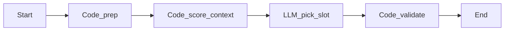

# WF-FollowUp-Enqueue-01 单患者随访入队排班 Dify 工作流

> 版本：v1.1  
> 状态：可部署  
> 后端对接：`FollowUpEnqueueDifyService` → `FollowUpShiftEnqueueService.applyEnqueue`

## 用途

看诊结束后，为**单个新纳入患者**在当月 draft 排班中插入首次联系任务（默认看诊后 ≥14 个工作日），**不重算整月排班**（与 WF-FollowUp-Shift-01 分离）。

---

## 架构（5 节点）

```
开始 → Code_prep → Code_score_context → LLM_pick_slot → Code_validate → 结束
```




---


## Dify 变量映射总表


| 节点                     | Dify 节点名建议         | 输入变量                                                                                                                                                                           | 输出变量                                                                                                                                                                           | 类型              |
| ---------------------- | ------------------ | ------------------------------------------------------------------------------------------------------------------------------------------------------------------------------ | ------------------------------------------------------------------------------------------------------------------------------------------------------------------------------ | --------------- |
| **Start**              | （开始）               | （后端传入，见下表）                                                                                                                                                                     | —                                                                                                                                                                              | text-input ×10  |
| **Code_prep**          | `prep_enqueue`     | `register_id`, `visit_ended_at`, `department_id`, `department_name`, `priority_level`, `patient_json`, `prescription_json`, `staff_json`, `existing_shifts_json`, `rules_json` | `register_id`, `visit_ended_at`, `department_id`, `department_name`, `priority_level`, `patient_json`, `prescription_json`, `staff_json`, `existing_shifts_json`, `rules_json` | string / number |
| **Code_score_context** | `score_context`    | `visit_ended_at`, `rules_json`                                                                                                                                                 | `earliest_work_date`, `min_days_after_visit`, `scheduling_window_json`                                                                                                         | string          |
| **LLM_pick_slot**      | `llm_pick_slot`    | `register_id`, `visit_ended_at`, `department_id`, `department_name`, `priority_level`, `patient_json`, `prescription_json`, `staff_json`, `existing_shifts_json`, `rules_json`, `earliest_work_date`, `min_days_after_visit` | `draft_enqueue_json`                                                                                                                                                           | string          |
| **Code_validate**      | `validate_enqueue` | `draft_enqueue_json`, `earliest_work_date`, `staff_json`, `rules_json`, `register_id`, `priority_level`                                                                        | `enqueue_result_json`                                                                                                                                                          | string          |
| **End**                | （结束）               | `enqueue_result_json`                                                                                                                                                          | （工作流输出）                                                                                                                                                                        | text            |


**End 节点对外输出变量名必须为** `enqueue_result_json`（与 `FollowUpEnqueueDifyService.parseEnqueueOutput` 一致）。

### 节点间连线（Dify 变量引用）


| 上游节点                           | 上游输出                  | →   | 下游节点               | 下游输入                                                        |
| ------------------------------ | --------------------- | --- | ------------------ | ----------------------------------------------------------- |
| Start                          | 全部 10 个字段             | →   | Code_prep          | 同名 10 个字段                                                   |
| Code_prep                      | 全部 10 个字段             | →   | Code_score_context | `visit_ended_at`, `rules_json`                              |
| Code_prep                      | `register_id` 等       | →   | Code_validate      | `register_id`, `staff_json`, `rules_json`, `priority_level` |
| Code_score_context             | `earliest_work_date`  | →   | Code_validate      | `earliest_work_date`                                        |
| Code_prep                      | 10 个字段 + score 的 2 个字段 | →   | LLM_pick_slot      | 见 LLM 节点「输入（平铺变量）」表；User Prompt 用 `{{#变量名#}}` 引用 |
| LLM_pick_slot                  | `draft_enqueue_json`  | →   | Code_validate      | `draft_enqueue_json`                                        |
| Code_validate                  | `enqueue_result_json` | →   | End                | `enqueue_result_json`                                       |


> **LLM 节点**：不使用合并 JSON。在 LLM 节点变量区逐个绑定 prep / score 输出，User Prompt 用 `{{#register_id#}}` 等形式平铺引用（全文见下文「User Prompt（直接粘贴）」）。

---


## Start 节点 — 后端入参

全部由 Java 后端 `FollowUpEnqueueDifyService.buildWorkflowInputs` 传入，类型均为 **text-input**。


| 变量名                    | 说明                                | 示例                    |
| ---------------------- | --------------------------------- | --------------------- |
| `register_id`          | 挂号 ID                             | `9001`                |
| `visit_ended_at`       | 看诊结束时间 ISO                        | `2026-07-03T12:00:00` |
| `department_id`        | 临床科室 ID（= `register.deptment_id`） | `7`                   |
| `department_name`      | 科室名称                              | `内分泌科`                |
| `priority_level`       | 规则引擎结果                            | `high`                |
| `patient_json`         | 患者摘要 JSON 字符串                     | 见下                    |
| `prescription_json`    | 用药列表 JSON 字符串                     | 见下                    |
| `staff_json`           | 科室随访护士 JSON 数组字符串                 | 见下                    |
| `existing_shifts_json` | 当月+下月已有排班片段 JSON 数组               | 见下                    |
| `rules_json`           | 约束规则 JSON 对象字符串                   | 见下                    |


### Dify「运行 / 调试」时 Start 各字段填什么

`patient_json` / `prescription_json` / `staff_json` / `existing_shifts_json` / `rules_json` 必须填 **合法 JSON 字符串**（双引号）。


| 变量                     | 直接粘贴的值                                                                                                                            |
| ---------------------- | --------------------------------------------------------------------------------------------------------------------------------- |
| `register_id`          | `9001`                                                                                                                            |
| `visit_ended_at`       | `2026-07-03T12:00:00`                                                                                                             |
| `department_id`        | `7`                                                                                                                               |
| `department_name`      | `内分泌科`                                                                                                                            |
| `priority_level`       | `high`                                                                                                                            |
| `patient_json`         | `{"register_id":9001,"diagnosis_summary":"2型糖尿病","chief_complaint":"多饮多尿","monitoring_employee_id":null}`                         |
| `prescription_json`    | `[{"drugName":"二甲双胍","drugUsage":"0.5g bid"}]`                                                                                    |
| `staff_json`           | `[{"id":123,"name":"内分泌护士","departmentId":7}]`                                                                                    |
| `existing_shifts_json` | `[{"shiftId":10,"planId":12,"employeeId":123,"employeeName":"内分泌护士","workDate":"2026-07-18","taskCount":2,"planStatus":"draft"}]` |
| `rules_json`           | `{"min_days_after_visit":14,"max_patients_per_day":8,"prefer_monitor_employee_id":""}`                                            |


### patient_json 结构

```json
{
  "register_id": 9001,
  "diagnosis_summary": "2型糖尿病",
  "chief_complaint": "多饮、多尿",
  "monitoring_employee_id": 123
}
```

> 来源：`FollowUpClinicalSnapshotService.getOrSyncLastVisit` + `FollowUpDashboardMapper.selectMonitoringByRegisterId`。


### prescription_json 结构

```json
[
  {"drugId": 1, "drugName": "二甲双胍", "drugUsage": "0.5g bid", "drugNumber": 2}
]
```


### staff_json 结构

```json
[
  {"id": 123, "name": "内分泌护士", "departmentId": 7}
]
```

> 来源：`FollowUpShiftMapper.selectFollowUpStaffByDepartment`（`user_type=7`）。


### existing_shifts_json 结构

```json
[
  {
    "shiftId": 10,
    "planId": 12,
    "month": "2026-07",
    "planStatus": "draft",
    "employeeId": 123,
    "employeeName": "内分泌护士",
    "workDate": "2026-07-18",
    "taskCount": 2
  }
]
```

> 来源：`FollowUpShiftMapper.selectShiftsWithTaskCounts`（当月 + 下月，status 为 draft 或 published）。


### rules_json 结构

```json
{
  "min_days_after_visit": 14,
  "max_patients_per_day": 8,
  "prefer_monitor_employee_id": 123
}
```


| 字段                           | 含义                       |
| ---------------------------- | ------------------------ |
| `min_days_after_visit`       | 看诊结束后至少间隔多少**工作日**才能首次联系 |
| `max_patients_per_day`       | 护士单日联系任务上限               |
| `prefer_monitor_employee_id` | 优先监视护士（可为空）              |


---


## Code 节点① — 预处理数据

**Dify 节点名**：`prep_enqueue`

### 输入


| 变量                     | 类型     | 来源    |
| ---------------------- | ------ | ----- |
| `register_id`          | string | Start |
| `visit_ended_at`       | string | Start |
| `department_id`        | string | Start |
| `department_name`      | string | Start |
| `priority_level`       | string | Start |
| `patient_json`         | string | Start |
| `prescription_json`    | string | Start |
| `staff_json`           | string | Start |
| `existing_shifts_json` | string | Start |
| `rules_json`           | string | Start |


### 输出


| 变量                     | 类型     | 说明             |
| ---------------------- | ------ | -------------- |
| `register_id`          | number | 解析后的挂号 ID      |
| `visit_ended_at`       | string | 原样透传           |
| `department_id`        | number | 解析后的科室 ID      |
| `department_name`      | string | 原样透传           |
| `priority_level`       | string | 默认 `normal`    |
| `patient_json`         | string | 规范化后的 JSON 字符串 |
| `prescription_json`    | string | 规范化后的 JSON 字符串 |
| `staff_json`           | string | 规范化后的 JSON 字符串 |
| `existing_shifts_json` | string | 规范化后的 JSON 字符串 |
| `rules_json`           | string | 规范化后的 JSON 字符串 |


### Python（粘贴到 Dify Code 节点）

```python
import json

def _parse_json(value, default):
    if value is None:
        return default
    if isinstance(value, (list, dict)):
        return value
    text = str(value).strip()
    if not text:
        return default
    return json.loads(text)

def main(register_id: str, visit_ended_at: str, department_id: str, department_name: str,
         priority_level: str, patient_json: str, prescription_json: str,
         staff_json: str, existing_shifts_json: str, rules_json: str) -> dict:
    staff = _parse_json(staff_json, [])
    rules = _parse_json(rules_json, {})
    if not register_id or not department_id:
        raise ValueError('register_id 与 department_id 不能为空')
    if not staff:
        raise ValueError('staff_json 为空，科室无随访护士')
    return {
        'register_id': int(register_id),
        'visit_ended_at': visit_ended_at,
        'department_id': int(department_id),
        'department_name': department_name or '',
        'priority_level': priority_level or 'normal',
        'patient_json': json.dumps(_parse_json(patient_json, {}), ensure_ascii=False),
        'prescription_json': json.dumps(_parse_json(prescription_json, []), ensure_ascii=False),
        'staff_json': json.dumps(staff, ensure_ascii=False),
        'existing_shifts_json': json.dumps(_parse_json(existing_shifts_json, []), ensure_ascii=False),
        'rules_json': json.dumps(rules, ensure_ascii=False),
    }
```

---


## Code 节点② — 计算最早可排日

**Dify 节点名**：`score_context`

### 输入


| 变量               | 类型     | 来源        |
| ---------------- | ------ | --------- |
| `visit_ended_at` | string | Code_prep |
| `rules_json`     | string | Code_prep |


### 输出


| 变量                       | 类型     | 说明                   |
| ------------------------ | ------ | -------------------- |
| `earliest_work_date`     | string | 最早可排联系日 `yyyy-MM-dd` |
| `min_days_after_visit`   | number | 规则中的最小间隔工作日          |
| `scheduling_window_json` | string | 供 LLM 使用的窗口摘要 JSON   |


`scheduling_window_json` 示例：

```json
{
  "visit_ended_at": "2026-07-03T12:00:00",
  "earliest_work_date": "2026-07-23",
  "min_days_after_visit": 14
}
```


### Python

```python
import json
from datetime import datetime, timedelta

def add_business_days(start, days):
    d = start
    added = 0
    while added < days:
        d += timedelta(days=1)
        if d.weekday() < 5:
            added += 1
    return d

def main(visit_ended_at: str, rules_json: str) -> dict:
    rules = json.loads(rules_json) if isinstance(rules_json, str) else (rules_json or {})
    min_days = int(rules.get('min_days_after_visit', 14))
    visit = datetime.fromisoformat(str(visit_ended_at).replace('Z', '+00:00')[:19])
    earliest = add_business_days(visit.date(), min_days)
    window = {
        'visit_ended_at': visit_ended_at,
        'earliest_work_date': earliest.isoformat(),
        'min_days_after_visit': min_days,
    }
    return {
        'earliest_work_date': earliest.isoformat(),
        'min_days_after_visit': min_days,
        'scheduling_window_json': json.dumps(window, ensure_ascii=False),
    }
```

---


## LLM 节点 — 选择首次联系日与护士

**Dify 节点名**：`llm_pick_slot`

### 输入（平铺变量，推荐）

LLM 节点**不要**使用合并的 `planning_context_json`。在 Dify LLM 节点的「变量 / 上下文」中，逐个添加上游输出：

| 变量 | 来源节点 | 说明 |
|------|----------|------|
| `register_id` | Code_prep | 挂号 ID |
| `visit_ended_at` | Code_prep | 看诊结束时间 |
| `department_id` | Code_prep | 科室 ID |
| `department_name` | Code_prep | 科室名称 |
| `priority_level` | Code_prep | 看护级别 |
| `patient_json` | Code_prep | 患者摘要 JSON 字符串 |
| `prescription_json` | Code_prep | 用药 JSON 字符串 |
| `staff_json` | Code_prep | 护士列表 JSON 字符串 |
| `existing_shifts_json` | Code_prep | 已有排班 JSON 字符串 |
| `rules_json` | Code_prep | 规则 JSON 字符串 |
| `earliest_work_date` | Code_score_context | 最早可排联系日 |
| `min_days_after_visit` | Code_score_context | 最小间隔工作日（可选） |

> Dify 操作：LLM 节点 → 添加变量 → 每个变量选择对应上游节点的输出字段 → 在 User Prompt 里用 `{{#变量名#}}` 引用。

### 输出


| 变量                   | 类型     | 说明                   |
| -------------------- | ------ | -------------------- |
| `draft_enqueue_json` | string | LLM 生成的入队草案 JSON 字符串 |


**输出 JSON Schema（LLM 必须遵守）**：

```json
{
  "register_id": 9001,
  "employee_id": 123,
  "work_date": "2026-07-23",
  "priority": "high",
  "summary": "看诊后第14个工作日首次联系"
}
```


| 字段            | 类型     | 约束                                    |
| ------------- | ------ | ------------------------------------- |
| `register_id` | number | 必须等于输入中的 register_id                  |
| `employee_id` | number | 必须来自 staff.id                         |
| `work_date`   | string | `yyyy-MM-dd`，且 ≥ `earliest_work_date` |
| `priority`    | string | `critical` / `high` / `normal`        |
| `summary`     | string | 简短中文说明                                |


### System Prompt（直接粘贴）

```
你是医院随访排班助手。任务：为单个患者选择「首次电话/微信联系」的日期与负责护士。

必须遵守：
1. work_date 格式 yyyy-MM-dd，且不得早于「最早可排联系日」
2. employee_id 只能使用「可选护士列表」JSON 里出现的 id 字段
3. register_id 必须与输入的挂号 ID 一致
4. priority 使用输入的 priority_level，或与其一致
5. 若 rules_json 中有 prefer_monitor_employee_id 且该护士当日 taskCount 未达 max_patients_per_day，优先选该护士
6. 否则在 earliest_work_date 之后，从 existing_shifts_json 中选负载最低的工作日；若无合适班次，选 earliest_work_date 当天或之后第一个工作日
7. 只输出一个 JSON 对象，不要用 markdown 代码块，不要附加任何解释文字

输出 JSON 必须包含且仅包含以下字段：
register_id, employee_id, work_date, priority, summary
```

### User Prompt（直接粘贴，平铺变量版）

在 Dify LLM 节点的 User 消息框中**原样粘贴**以下内容（变量引用语法与 WF-FollowUp-Shift-01 一致：`{{#变量名#}}`）：

```
请为以下患者安排首次随访联系，并输出入队草案 JSON。

【挂号 ID】
{{#register_id#}}

【看诊结束时间】
{{#visit_ended_at#}}

【科室】
{{#department_id#}} / {{#department_name#}}

【看护级别 priority_level】
{{#priority_level#}}

【最早可排联系日 earliest_work_date（work_date 不得早于此日）】
{{#earliest_work_date#}}

【最小间隔工作日】
{{#min_days_after_visit#}}

【患者摘要 patient_json】
{{#patient_json#}}

【用药 prescription_json】
{{#prescription_json#}}

【可选护士列表 staff_json（employee_id 只能从这里选）】
{{#staff_json#}}

【已有排班片段 existing_shifts_json（含 workDate、employeeId、taskCount）】
{{#existing_shifts_json#}}

【规则 rules_json（含 min_days_after_visit、max_patients_per_day、prefer_monitor_employee_id）】
{{#rules_json#}}

请只输出一个 JSON 对象，字段如下（示例结构，值必须用上面输入中的真实 ID 与日期）：
{"register_id":9001,"employee_id":123,"work_date":"2026-07-23","priority":"high","summary":"看诊后第14个工作日首次联系"}
```

**Dify 配置步骤：**

1. 打开 LLM 节点 →「上下文 / 变量」→ 添加上表 12 个变量，分别绑定 `prep_enqueue` 与 `score_context` 的同名输出。
2. 将上面 System / User 全文分别粘贴到对应输入框。
3. 若你的 Dify 版本变量语法是 `{{variable}}` 而非 `{{#variable#}}`，把 Prompt 中所有 `{{#xxx#}}` 改成 `{{xxx}}` 即可。
4. 开启「结构化输出 / JSON」时，输出变量名设为 `draft_enqueue_json`；若 LLM 节点自动把 JSON 写入 `text`，Code_validate 的入参仍接 `draft_enqueue_json`（可在 LLM 输出映射里把 `text` 重命名为 `draft_enqueue_json`）。

### User Prompt 示例（填充后 LLM 实际看到的内容）

仅供理解，**不要**写进 Dify（Dify 会自动替换变量）：

```
请为以下患者安排首次随访联系，并输出入队草案 JSON。

【挂号 ID】
9001

【看诊结束时间】
2026-07-03T12:00:00

【科室】
7 / 内分泌科

【看护级别 priority_level】
high

【最早可排联系日 earliest_work_date（work_date 不得早于此日）】
2026-07-23

【最小间隔工作日】
14

【患者摘要 patient_json】
{"register_id":9001,"diagnosis_summary":"2型糖尿病","chief_complaint":"多饮多尿"}

【用药 prescription_json】
[{"drugName":"二甲双胍","drugUsage":"0.5g bid"}]

【可选护士列表 staff_json（employee_id 只能从这里选）】
[{"id":123,"name":"内分泌护士","departmentId":7}]

【已有排班片段 existing_shifts_json（含 workDate、employeeId、taskCount）】
[{"shiftId":10,"employeeId":123,"workDate":"2026-07-18","taskCount":2,"planStatus":"draft"}]

【规则 rules_json（含 min_days_after_visit、max_patients_per_day、prefer_monitor_employee_id）】
{"min_days_after_visit":14,"max_patients_per_day":8,"prefer_monitor_employee_id":""}

请只输出一个 JSON 对象...
```


### Dify LLM 节点配置


| 配置项        | 建议值                   |
| ---------- | --------------------- |
| 输出变量名      | `draft_enqueue_json`  |
| 温度         | 0.2 ~ 0.3             |
| max tokens | 1024                  |
| 结构化输出      | 若支持 JSON Schema，按上表约束 |


---


## Code 节点③ — 校验并输出最终结果

**Dify 节点名**：`validate_enqueue`

### 输入


| 变量                   | 类型     | 来源                 |
| -------------------- | ------ | ------------------ |
| `draft_enqueue_json` | string | LLM_pick_slot      |
| `earliest_work_date` | string | Code_score_context |
| `staff_json`         | string | Code_prep          |
| `rules_json`         | string | Code_prep          |
| `register_id`        | number | Code_prep          |
| `priority_level`     | string | Code_prep          |


### 输出


| 变量                    | 类型     | 说明                     |
| --------------------- | ------ | ---------------------- |
| `enqueue_result_json` | string | **End 节点唯一对外输出**，后端落库用 |


`enqueue_result_json` 解析后结构：

```json
{
  "register_id": 9001,
  "employee_id": 123,
  "work_date": "2026-07-23",
  "priority": "high",
  "summary": "看诊后第14个工作日首次联系"
}
```


| 字段              | 必填  | 后端用途                                             |
| --------------- | --- | ------------------------------------------------ |
| `register_id`   | 是   | 联系任务关联患者                                         |
| `employee_id`   | 是   | 查找/创建 `follow_up_staff_shift`                    |
| `work_date`     | 是   | 排班日期；幂等键 `register_id + work_date`               |
| `priority`      | 否   | 写入 `follow_up_shift_contact_task.priority_level` |
| `summary`       | 否   | 日志 / AI 摘要                                       |
| `shift_plan_id` | 否   | 可选；后端按 `work_date` 查 draft 计划，不依赖 LLM 返回         |


### Python（v1.2 — 兼容 Dify LLM 脏输出 + 失败规则降级）

> **你遇到的 `KeyError: 'work_date'`**：`draft_enqueue_json` 不是合法入队 JSON，而是 LLM 在变量未注入时输出的乱码 dict。  
> 本版会先尝试从 `text` / JSON 字符串 / 嵌套 dict 中提取；仍失败则用 `staff_json` + `earliest_work_date` **规则降级**，保证工作流不中断。

**Dify Code 节点入参类型**：`draft_enqueue_json` 建议设为 **string**；若 LLM 输出是 object，Dify 可能以 dict 传入，代码已兼容。

```python
import json
import re
from datetime import date, timedelta

DATE_RE = re.compile(r'\b(20\d{2}-\d{2}-\d{2})\b')
JSON_OBJ_RE = re.compile(r'\{[^{}]*"register_id"[^{}]*\}', re.DOTALL)


def _parse_json(value, default):
    if value is None:
        return default
    if isinstance(value, (list, dict)):
        return value
    text = str(value).strip()
    if not text:
        return default
    if text.startswith('```'):
        lines = text.splitlines()
        text = '\n'.join(lines[1:-1] if lines and lines[-1].strip() == '```' else lines[1:]).strip()
    try:
        return json.loads(text)
    except json.JSONDecodeError:
        return default


def _pick(obj, *keys, default=None):
    if not isinstance(obj, dict):
        return default
    for key in keys:
        if key in obj and obj[key] not in (None, ''):
            return obj[key]
    return default


def _normalize_enqueue_dict(raw):
    if not isinstance(raw, dict):
        return None
    register_id = _pick(raw, 'register_id', 'registerId')
    employee_id = _pick(raw, 'employee_id', 'employeeId')
    work_date = _pick(raw, 'work_date', 'workDate')
    priority = _pick(raw, 'priority', 'priority_level', 'priorityLevel', default='normal')
    summary = _pick(raw, 'summary', default='首次随访联系')
    if register_id is None or employee_id is None or work_date is None:
        return None
    return {
        'register_id': int(register_id),
        'employee_id': int(employee_id),
        'work_date': str(work_date)[:10],
        'priority': str(priority),
        'summary': str(summary),
    }


def _extract_from_llm_output(draft_enqueue_json):
    # 1) 已是合法 dict
    if isinstance(draft_enqueue_json, dict):
        if 'text' in draft_enqueue_json and len(draft_enqueue_json) <= 3:
            parsed = _parse_json(draft_enqueue_json.get('text'), {})
            ok = _normalize_enqueue_dict(parsed)
            if ok:
                return ok
        ok = _normalize_enqueue_dict(draft_enqueue_json)
        if ok:
            return ok
        # 2) LLM 乱码 dict：在 key/value 里搜日期与数字
        blob = json.dumps(draft_enqueue_json, ensure_ascii=False)
        dates = DATE_RE.findall(blob)
        nums = [int(x) for x in re.findall(r'\b(\d{3,6})\b', blob)]
        if dates and nums:
            return {
                'register_id': nums[0],
                'employee_id': nums[1] if len(nums) > 1 else nums[0],
                'work_date': dates[0],
                'priority': 'high',
                'summary': '从 LLM 非结构化输出中提取',
            }

    # 3) 字符串 / JSON 文本
    text = str(draft_enqueue_json or '').strip()
    if not text:
        return None
    parsed = _parse_json(text, None)
    if isinstance(parsed, dict):
        ok = _normalize_enqueue_dict(parsed)
        if ok:
            return ok
    m = JSON_OBJ_RE.search(text)
    if m:
        ok = _normalize_enqueue_dict(_parse_json(m.group(0), {}))
        if ok:
            return ok
    dates = DATE_RE.findall(text)
    emp_match = re.search(r'"employee_id"\s*:\s*(\d+)', text)
    reg_match = re.search(r'"register_id"\s*:\s*(\d+)', text)
    if dates and emp_match and reg_match:
        return {
            'register_id': int(reg_match.group(1)),
            'employee_id': int(emp_match.group(1)),
            'work_date': dates[0],
            'priority': 'high',
            'summary': '从 LLM 文本中提取',
        }
    return None


def _add_business_days(start: date, days: int) -> date:
    d = start
    added = 0
    while added < days:
        d += timedelta(days=1)
        if d.weekday() < 5:
            added += 1
    return d


def _rule_fallback(staff_json, rules_json, earliest_work_date, register_id, priority_level):
    staff = _parse_json(staff_json, [])
    rules = _parse_json(rules_json, {})
    if not staff:
        raise ValueError('staff_json 为空，无法规则降级')
    staff_ids = [int(s['id']) for s in staff if s.get('id') is not None]
    prefer = rules.get('prefer_monitor_employee_id')
    if prefer not in (None, '', 0, '0'):
        prefer = int(prefer)
        employee_id = prefer if prefer in staff_ids else staff_ids[0]
    else:
        employee_id = staff_ids[0]
    earliest = date.fromisoformat(str(earliest_work_date)[:10])
    return {
        'register_id': int(register_id),
        'employee_id': employee_id,
        'work_date': earliest.isoformat(),
        'priority': priority_level or 'normal',
        'summary': 'LLM 输出无效，validate 规则降级至最早可排日',
    }


def main(draft_enqueue_json, earliest_work_date: str, staff_json: str,
         rules_json: str, register_id: int, priority_level: str) -> dict:
    data = _extract_from_llm_output(draft_enqueue_json)
    if data is None:
        data = _rule_fallback(staff_json, rules_json, earliest_work_date, register_id, priority_level)

    work_date = date.fromisoformat(str(data['work_date'])[:10])
    earliest = date.fromisoformat(str(earliest_work_date)[:10])
    if work_date < earliest:
        data = _rule_fallback(staff_json, rules_json, earliest_work_date, register_id, priority_level)
        work_date = date.fromisoformat(str(data['work_date'])[:10])

    staff = _parse_json(staff_json, [])
    staff_ids = {int(s['id']) for s in staff if s.get('id') is not None}
    emp = int(data['employee_id'])
    if emp not in staff_ids:
        data = _rule_fallback(staff_json, rules_json, earliest_work_date, register_id, priority_level)
        emp = int(data['employee_id'])

    result = {
        'register_id': int(data.get('register_id', register_id)),
        'employee_id': emp,
        'work_date': str(data['work_date'])[:10],
        'priority': data.get('priority') or priority_level or 'normal',
        'summary': data.get('summary') or '首次随访联系',
    }
    return {'enqueue_result_json': json.dumps(result, ensure_ascii=False)}
```

**本用例输入下，规则降级预期输出：**

```json
{"register_id":9001,"employee_id":123,"work_date":"2026-07-23","priority":"high","summary":"LLM 输出无效，validate 规则降级至最早可排日"}
```

---


## End 节点


### 输入


| 变量                    | 类型     | 来源            |
| --------------------- | ------ | ------------- |
| `enqueue_result_json` | string | Code_validate |


### 输出（工作流对外）


| 变量                    | 类型   | 消费者                                             |
| --------------------- | ---- | ----------------------------------------------- |
| `enqueue_result_json` | text | `FollowUpEnqueueDifyService.parseEnqueueOutput` |


---


## 环境变量（与月度排班 Key 分离）

```env
DIFY_WORKFLOW_FOLLOW_UP_ENQUEUE=true
DIFY_API_KEY_FOLLOW_UP_ENQUEUE=app-xxx
```

`application.yml` 映射：

```yaml
xikang.ai.dify:
  workflow-follow-up-enqueue: ${DIFY_WORKFLOW_FOLLOW_UP_ENQUEUE:true}
  api-key-follow-up-enqueue: ${DIFY_API_KEY_FOLLOW_UP_ENQUEUE:}
```

---


## 后端落库逻辑

1. 解析 `enqueue_result_json` → `register_id`, `employee_id`, `work_date`, `priority`
2. 幂等：`selectContactTaskByRegisterAndWorkDate`，已存在则跳过
3. 查找 `work_date` 对应科室当月 **draft** `follow_up_shift_plan`
4. 查找/创建 `follow_up_staff_shift`
5. `INSERT follow_up_shift_contact_task`（`ON CONFLICT (shift_id, register_id) DO NOTHING`）
6. 无 draft 计划 → 写入 `follow_up_pending_schedule`
7. Dify 失败 → 规则降级：`visit + 14 工作日` + 轮值护士

---


## 与 WF-FollowUp-Shift-01 关系


| 场景           | 行为                                    |
| ------------ | ------------------------------------- |
| 已有当月 draft   | Enqueue 向 draft 插入 1 条 task           |
| 仅有 published | 写入 pending 队列或下月 draft                |
| 月度 AI 重生成    | 保留已 enqueue task；冲突按 register+date 去重 |


---


## 触发链路

```
PhysicianService.endVisit
  → POST /api/medtech/internal/follow-up/visit-ended
  → FollowUpAutoEnrollService（入池 + 快照）
  → FollowUpShiftEnqueueService.enqueueAsync
  → FollowUpEnqueueDifyService.planEnqueue
```

内部鉴权 Header：`X-Internal-Token: ${INTERNAL_AI_TOKEN}`

---


## 部署检查清单


| #   | 检查项                                         |
| --- | ------------------------------------------- |
| 1   | Start 10 个变量名与后端 `buildWorkflowInputs` 一致   |
| 2   | Code_prep 输出变量已在 Dify「输出」中声明                |
| 3   | LLM 输出变量名为 `draft_enqueue_json`             |
| 4   | Code_validate 输出变量名为 `enqueue_result_json`  |
| 5   | End 仅暴露 `enqueue_result_json`               |
| 6   | `.env` 已配置 `DIFY_API_KEY_FOLLOW_UP_ENQUEUE` |


---


## 常见问题


| 现象                         | 原因                              | 处理                            |
| -------------------------- | ------------------------------- | ----------------------------- |
| validate 报 `KeyError: 'work_date'` | LLM 输出乱码 dict，非合法 JSON | 见「LLM 变量未注入」；validate 换 **v1.2** 代码 |
| 后端报「Dify 未返回有效输出」          | End 变量名不是 `enqueue_result_json` | 检查 End 节点映射                   |
| Code_validate 报 nurse 不在列表 | LLM 编造了 employee_id             | v1.2 自动规则降级                    |
| work_date 早于 earliest      | LLM 未遵守约束                       | v1.2 自动改为 earliest_work_date   |
| staff_json 为空              | 科室未配置随访护士（user_type=7）          | 先在管理端维护人员                     |

### LLM 变量未注入（`KeyError: 'work_date'` 根因）

`draft_enqueue_json` 若类似下面这种结构，说明 **LLM 没收到真实变量**，模型在「猜」而不是排班：

```json
{
  "2026-07-23\" 作为示例...": "但这违反了..."
}
```

**检查清单：**

1. 必须从 **Start 整链运行**，不要单独调试 LLM 节点。
2. LLM → 上下文/变量：12 个变量绑定 `prep_enqueue` / `score_context` 同名输出。
3. 预览 User Prompt 里应显示 `9001`，不是 `{{#register_id#}}`。
4. validate 的 `draft_enqueue_json` 接 LLM 的 **`text`** 或结构化 JSON 字段，不要接整个原始 object。
5. validate 使用上文 **Python v1.2**：LLM 无效时自动输出  
   `{"register_id":9001,"employee_id":123,"work_date":"2026-07-23","priority":"high",...}`

