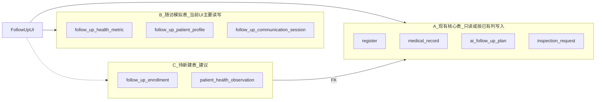

# 随访系统数据缺口分析

> **文档版本**：v1.0  
> **日期**：2026-06-27  
> **读者**：DBA、挂号/医技/药房/后端负责人  
> **目的**：随访 UI 与 medtech-service 已基本就绪，但联调需从「模拟数据」切换到「现有业务表只读 + 新建随访域表」。本文档在 **不修改任何现有表结构与数据** 的前提下，说明缺口与建议新建表。

---

## 0. 约束与术语

### 0.1 硬约束

| 编号 | 约束 |
|------|------|
| C1 | **禁止** 对现有核心业务表执行 `ALTER TABLE`、加列、改约束、UPDATE 迁移生产数据 |
| C2 | 缺口只能通过：**新建表**（FK 引用现有表）、**应用层只读查询**、或 **继续使用随访模拟表**（演示/过渡） |
| C3 | 随访模拟表 **不计入**「现有表」；不得将其描述为医院已有生产能力 |

### 0.2 三类表

| 类型 | 说明 | 示例 |
|------|------|------|
| **A. 现有核心表** | init.sql / schema_snapshot 中的业务与 AI 表（README 所称 26 张 + 表单引擎 2 张；init 还含 users、patient、费用等扩展表） | `register`, `medical_record`, `ai_follow_up_plan` |
| **B. 随访模拟表** | migrate_014–019 为随访迭代新增的 `follow_up_*` 表，含演示种子 | `follow_up_health_metric`, `follow_up_patient_profile` |
| **C. 待新建表** | 由 DBA 评审后创建，供生产联调 | `follow_up_enrollment`, `patient_health_observation` |



---

## 1. 随访功能与数据需求概览

| 步骤 | 前端页面 | 核心数据需求 |
|------|----------|--------------|
| 1 | 随访工作台 | 在管患者池、优先级、今日访谈/观察待办、月历日程 |
| 2 | 疗效评估 | 患者列表、诊断/病种、**时序健康指标**、症状缓解趋势、患者详情 |
| 3 | 医患沟通 | 会话与消息、AI 病例总结、患者摘要（诊断/指标/今日状态） |
| 4 | 随访计划 | 用药/康复计划列表（患者端 Tab 占位） |
| 5 | 随访记录 | 历史反馈与 AI 评估（患者端 Tab 占位） |

当前 medtech-service **大量依赖 B 类模拟表**；A 类表主要用于病历、挂号、AI 随访计划/记录、检验检查文本结果。

---

## 2. 现有核心表清单（A 类，不可改结构）

以 [`docker/init-db/init.sql`](xikang-cloud-hospital/docker/init-db/init.sql)、[`docker/migrations/README.md`](xikang-cloud-hospital/docker/migrations/README.md) 为准。

### 2.1 基础字典（7）

| 表 | 随访只读用途 |
|----|--------------|
| `department` | 科室名称；医技在管科室与挂号科室可能不同 |
| `regist_level` | 患者详情：号别 |
| `scheduling` | 排班（间接） |
| `settle_category` | 患者详情：结算类别 |
| `disease` | 病种名称、`disease_category`（疗效图表匹配） |
| `drug_info` | 药品字典（用药计划展示） |
| `medical_technology` | 检查/检验项目 |

### 2.2 表单引擎（2）

| 表 | 随访只读用途 |
|----|--------------|
| `result_form_category` | 检查结果表单分类 |
| `result_form_field` | 结构化字段定义；**结果值落在 request 行 TEXT 上，非独立时序表** |

### 2.3 核心业务（7 + 关联）

| 表 | 随访只读/写入用途 | 是否足够 |
|----|-------------------|----------|
| `employee` | 接诊医生、操作人 | 足够 |
| `register` | 患者标识、病历号、看诊状态 `visit_state`、挂号科室 | **部分**：无 `patient_id` 强 FK，联系方式需弱匹配 `patient` |
| `medical_record` | 诊断、主诉(`readme`)、现病史、过敏史、初步诊断等 | **足够**（单挂号一条） |
| `medical_record_disease` | 关联 ICD 疾病，用于图表 profile | 足够 |
| `check_request` | `check_result` TEXT/JSON、检查时间 | **不足**：非按日 EAV 指标 |
| `inspection_request` | `inspection_result` TEXT/JSON、检验时间 | **不足**：同上 |
| `disposal_request` | 处置记录 | 随访次要 |
| `prescription` | 用药来源 | 足够 |

### 2.4 患者与账户（init 扩展，属现有库）

| 表 | 随访用途 |
|----|----------|
| `patient` | 电话、地址、身份证（与 register 弱关联） |
| `users` | 患者端账号、电话/邮箱 |
| `user_patient_managed` | 多患者管理 |
| `patient_clinical_profile` | 临床画像扩展 |
| `expense_record` / `patient_balance_transaction` | 非随访主路径 |

### 2.5 AI 记录（9，含随访计划/反馈）

| 表 | 随访用途 | 是否足够 |
|----|----------|----------|
| `ai_follow_up_plan` | **用药/康复随访计划**（`prescription_id`, `follow_up_type`, `plan_status`） | 结构足够；需药房/AI 写入真实数据 |
| `ai_follow_up_record` | 症状缓解、副作用、患者反馈、AI 评估 | 结构足够；需患者端/工作流写入 |
| `ai_consultation_record` | 预问诊、过敏摘要 | 只读补充 |
| `ai_triage_record` | 导诊 | 可选 |
| 其他 ai_* | Exam/Diagnosis/Prescription Review | 非随访主路径 |

> **说明**：`ai_follow_up_plan` / `ai_follow_up_record` 是 **现有表**，随访可直接 SELECT/INSERT **已有列**；若缺关联字段（如病例总结 ID），须 **新建关联表**，不得 ALTER 这两张表。

---

## 3. 随访模拟表清单（B 类，不计入现有表）

| 表 | 引入脚本 | 用途 | 当前数据状况 |
|----|----------|------|--------------|
| `follow_up_health_metric` | migrate_014/015 | EAV 时序指标（血糖、血氧等） | 几乎均为 `source='simulated'`，种子 register 1001–1005 |
| `follow_up_interview_schedule` | migrate_014 | 周级访谈日程 | 演示数据；疗效页「加入访谈」写入 |
| `follow_up_patient_profile` | migrate_018 | 在管患者池、优先级、访谈/观察周期 | 仅演示 INSERT |
| `follow_up_day_schedule` | migrate_018 | 日级日程（访谈/观察/自定义） | 演示数据；工作台主路径 |
| `follow_up_daily_observation` | migrate_018 | 医生「今日已观察」确认 | 演示数据 |
| `follow_up_communication_session` | migrate_019 | 医患会话 | 演示 + 联调已上云 |
| `follow_up_communication_message` | migrate_019 | 消息时间线 | 同上 |
| `follow_up_case_summary` | migrate_019 | AI 草稿 / 医生定稿 / 发布 | 同上 |

**模拟表可保留**用于演示与 UI 开发，但 **不能** 作为「医院已有数据能力」向业务方说明。生产联调目标：由 **C 类新表** 或 **只读 A 类聚合** 替代 B 类中的关键读路径。

---

## 4. 页面 → 表依赖矩阵（medtech-service）

| 页面 / API | A 类（现有，只读为主） | B 类（模拟，当前读写） |
|------------|------------------------|------------------------|
| 疗效评估 · 患者列表 | `register`, `medical_record_disease`, `ai_follow_up_record` | `follow_up_health_metric`（EXISTS 条件） |
| 疗效评估 · 档案/详情 | `register`, `medical_record`, `department`, `employee`, `patient`, `users`, `ai_consultation_record`, `disease` | — |
| 疗效评估 · 指标图表 | — | **`follow_up_health_metric`（读写均模拟）** |
| 疗效评估 · 缓解趋势 | **`ai_follow_up_record`（读）** | — |
| 疗效评估 · 周访谈 | — | `follow_up_interview_schedule` |
| 工作台 · 在管患者 | `register` | **`follow_up_patient_profile`（INNER JOIN，无则列表空）** |
| 工作台 · 日程/月历 | — | `follow_up_day_schedule` |
| 工作台 · 观察确认 | — | `follow_up_daily_observation` |
| 工作台 · 日历打点 | — | `follow_up_day_schedule`, `follow_up_daily_observation`, `follow_up_health_metric` |
| 医患沟通 · 会话/消息 | `register` | `follow_up_communication_session`, `follow_up_communication_message`, `follow_up_case_summary` |
| 医患沟通 · 患者摘要 | 同疗效档案 + `follow_up_patient_profile`（LEFT JOIN 优先级） | `follow_up_health_metric`（近期指标） |
| CaseSummary 工作流上下文 | 同上 + `ai_follow_up_record` | `follow_up_health_metric`, `follow_up_daily_observation`, `follow_up_day_schedule` |
| 患者端 · 随访计划/反馈 | **应对接 `ai_follow_up_plan` / `ai_follow_up_record`** | 前端占位，未接 API |

---

## 5. 缺口矩阵

### P0 — 阻塞真实联调（无模拟种子则页面空或图表无数据）

| ID | 缺口描述 | 现有表能否覆盖 | 建议（仅新建表 / 只读，不改 A 类） |
|----|----------|----------------|-------------------------------------|
| G-P0-1 | **结构化时序健康指标**（血糖、血氧、血压等按日曲线） | `inspection_request.inspection_result`、`check_request.check_result` 为 TEXT/JSON，无统一 `metric_key` + `record_date` 模型 | **新建** `patient_health_observation`（或生产版 `follow_up_metric` 新表）：`register_id`, `observed_at`, `metric_code`, `value`, `unit`, `source_type`, `source_ref_id`；由 **ETL/后端 job** 从检验/检查 JSON **解析写入**（只读源表）。另可 **新建** `lab_metric_mapping`（检验项目/字段 → metric_code） |
| G-P0-2 | **在管患者池**（工作台患者列表） | 可用 A 类：`register.visit_state=3` + `medical_record_disease` 筛「看诊结束且有诊断」；但 **无** 优先级、访谈/观察周期、医技在管科室 | **新建** `follow_up_enrollment`：`register_id`, `managing_department_id`, `priority_level`, `interview_interval_days`, `observation_interval_days`, `enrolled_at`, `enrolled_by`, `status`；FK → `register.id`, `department.id` |
| G-P0-3 | **Outcome 与 Dashboard 患者范围不一致** | Outcome 认 metric 模拟 OR ai_follow_up_record OR disease；Dashboard 仅认 `follow_up_patient_profile` | 联调后 **统一以 `follow_up_enrollment` 为在管来源**（改 API 读新表，属应用层，不动 A 类表） |
| G-P0-4 | **双日程模型** | 无现有表对应 | **新建** 统一 `follow_up_schedule`（日粒度：`register_id`, `schedule_date`, `item_type`, `status`, `title`）；废弃 B 类 `follow_up_interview_schedule` 与 `follow_up_day_schedule` 并存；或保留 B 类其一并文档约定，**不**写入 A 类 |
| G-P0-5 | **医技科室过滤** | `register.deptment_id` 为 **临床挂号科室**；`employee.deptment_id` 为医技科室 | 在 **`follow_up_enrollment.managing_department_id`** 明确「在管科室」，与 `register.deptment_id` 解耦；**禁止** 改 `register` 加列 |

### P1 — 功能闭环与数据质量

| ID | 缺口描述 | 建议 |
|----|----------|------|
| G-P1-1 | 患者端「随访计划」Tab 无数据 | **只读/写入现有** `ai_follow_up_plan`（已有 `prescription_id`, `follow_up_type`, `plan_status`）；由药房发药后 AI 或定时任务 INSERT |
| G-P1-2 | 患者端「健康反馈」/ 缓解趋势写入 | **只读/写入现有** `ai_follow_up_record` 已有列 |
| G-P1-3 | 病例总结与随访记录未关联 | **新建** `follow_up_summary_link`（`case_summary_id` FK → B/C 总结表, `register_id`, `ai_follow_up_record_id` 可选）；**禁止** ALTER `ai_follow_up_record` |
| G-P1-4 | 患者联系方式弱匹配 | `selectPatientDetail` 用 `real_name + birthdate` 匹配 `patient`；**新建** `register_patient_link`（`register_id`, `patient_id`）供挂号模块维护；随访只读 |
| G-P1-5 | 检验/检查 → 指标映射规则缺失 | **新建** `lab_metric_mapping`（`tech_code` 或 form field_key → `metric_code`, `unit`） |
| G-P1-6 | 医患沟通域 | B 类 `follow_up_communication_*`、`follow_up_case_summary` 结构可 **保留为随访域正式表**（本身即为 migrate_019 新建，非 A 类）；或 rename 为生产表名，**仍不修改 A 类** |

### P2 — 预测与工作流（后续，仅新建表）

| ID | 说明 |
|----|------|
| G-P2-1 | **不建议** 每病种单独训练 ML（数据量不足）；推荐 Dify 工作流 + 近 30 天 `patient_health_observation` 摘要 + 规则阈值 |
| G-P2-2 | 若需存预测结果：**新建** `follow_up_metric_forecast`（`register_id`, `metric_code`, `forecast_date`, `value`, `confidence`, `model_id`, `workflow_run_id`） |
| G-P2-3 | 按患者路由工作流：读 A 类 `disease.disease_category` + C 类 enrollment 优先级 + 可用 metric 列表，**无需** 改现有表 |

---

## 6. 建议新建表 DDL 草案（供 DBA 评审）

> 以下均为 **新表**；FK 仅引用现有表主键；**不包含** 对 A 类的 ALTER。

### 6.1 `follow_up_enrollment`（在管患者池）

```sql
CREATE TABLE follow_up_enrollment (
    register_id                 INTEGER PRIMARY KEY REFERENCES register(id),
    managing_department_id      INTEGER NOT NULL REFERENCES department(id),
    priority_level              VARCHAR(16) NOT NULL DEFAULT 'normal',
    interview_interval_days     INTEGER NOT NULL DEFAULT 7,
    observation_interval_days   INTEGER NOT NULL DEFAULT 1,
    enrolled_at                 TIMESTAMP DEFAULT CURRENT_TIMESTAMP,
    enrolled_by                 INTEGER REFERENCES employee(id),
    status                      VARCHAR(16) NOT NULL DEFAULT 'active',
    CONSTRAINT chk_fue_priority CHECK (priority_level IN ('normal', 'high', 'critical')),
    CONSTRAINT chk_fue_status CHECK (status IN ('active', 'paused', 'closed'))
);
CREATE INDEX idx_fue_dept ON follow_up_enrollment(managing_department_id);
```

### 6.2 `patient_health_observation`（时序指标，替代模拟 metric 的生产来源）

```sql
CREATE TABLE patient_health_observation (
    id              SERIAL PRIMARY KEY,
    register_id     INTEGER NOT NULL REFERENCES register(id),
    observed_at     TIMESTAMP NOT NULL,
    metric_code     VARCHAR(64) NOT NULL,
    metric_value    NUMERIC(12, 4) NOT NULL,
    unit            VARCHAR(16),
    source_type     VARCHAR(32) NOT NULL,  -- lab / check / patient_report / device / ai_inferred
    source_ref_id   INTEGER,               -- inspection_request.id / check_request.id / 等
    note            TEXT,
    CONSTRAINT uk_pho_register_metric_time UNIQUE (register_id, metric_code, observed_at)
);
CREATE INDEX idx_pho_register_time ON patient_health_observation(register_id, observed_at DESC);
```

### 6.3 `lab_metric_mapping`（检验/检查 → 标准 metric_code）

```sql
CREATE TABLE lab_metric_mapping (
    id              SERIAL PRIMARY KEY,
    source_type     VARCHAR(16) NOT NULL,  -- inspection / check
    source_key      VARCHAR(128) NOT NULL, -- tech_code 或 result_form field_key
    metric_code     VARCHAR(64) NOT NULL,
    unit            VARCHAR(16),
    CONSTRAINT uk_lmm_source UNIQUE (source_type, source_key)
);
```

### 6.4 `follow_up_schedule`（统一日级日程，可选）

```sql
CREATE TABLE follow_up_schedule (
    id              SERIAL PRIMARY KEY,
    register_id     INTEGER NOT NULL REFERENCES register(id),
    department_id   INTEGER NOT NULL REFERENCES department(id),
    schedule_date   DATE NOT NULL,
    item_type       VARCHAR(16) NOT NULL,  -- interview / observation / custom
    title           VARCHAR(128) NOT NULL,
    status          VARCHAR(16) NOT NULL DEFAULT 'planned',
    created_by      INTEGER REFERENCES employee(id),
    creation_time   TIMESTAMP DEFAULT CURRENT_TIMESTAMP,
    CONSTRAINT chk_fus_item CHECK (item_type IN ('interview', 'observation', 'custom')),
    CONSTRAINT chk_fus_status CHECK (status IN ('planned', 'completed', 'cancelled'))
);
CREATE UNIQUE INDEX uk_fus_interview_day
    ON follow_up_schedule(register_id, schedule_date, item_type)
    WHERE item_type = 'interview';
```

### 6.5 `follow_up_daily_observation_prod`（或使用统一 observation 表）

可与 `follow_up_schedule` 合并为 `item_type='observation'` + 确认记录表；若独立：

```sql
CREATE TABLE follow_up_observation_confirm (
    id                  SERIAL PRIMARY KEY,
    register_id         INTEGER NOT NULL REFERENCES register(id),
    observation_date    DATE NOT NULL,
    observed_by         INTEGER REFERENCES employee(id),
    confirmed_at        TIMESTAMP DEFAULT CURRENT_TIMESTAMP,
    note                TEXT,
    CONSTRAINT uk_foc_register_date UNIQUE (register_id, observation_date)
);
```

### 6.6 `register_patient_link`（可选，强化患者关联）

```sql
CREATE TABLE register_patient_link (
    register_id     INTEGER PRIMARY KEY REFERENCES register(id),
    patient_id      INTEGER NOT NULL REFERENCES patient(id),
    linked_at       TIMESTAMP DEFAULT CURRENT_TIMESTAMP
);
```

### 6.7 `follow_up_summary_link`（病例总结 ↔ 随访记录，可选）

```sql
CREATE TABLE follow_up_summary_link (
    id                      SERIAL PRIMARY KEY,
    register_id             INTEGER NOT NULL REFERENCES register(id),
    case_summary_id         INTEGER NOT NULL,  -- FK → follow_up_case_summary 或新总结表
    ai_follow_up_record_id  INTEGER REFERENCES ai_follow_up_record(id),
    linked_at               TIMESTAMP DEFAULT CURRENT_TIMESTAMP
);
```

### 6.8 Phase 2：`follow_up_metric_forecast`（预测结果）

```sql
CREATE TABLE follow_up_metric_forecast (
    id              SERIAL PRIMARY KEY,
    register_id     INTEGER NOT NULL REFERENCES register(id),
    metric_code     VARCHAR(64) NOT NULL,
    forecast_date   DATE NOT NULL,
    forecast_value  NUMERIC(12, 4),
    confidence      NUMERIC(5, 4),
    model_id          VARCHAR(64),
    workflow_run_id   VARCHAR(128),
    creation_time     TIMESTAMP DEFAULT CURRENT_TIMESTAMP
);
```

---

## 7. 现有表字段 ↔ 随访字段映射（只读，附录 A 摘要）

| 随访 UI 字段 | 现有表.列 | 备注 |
|--------------|-----------|------|
| 患者姓名/病历号/性别/年龄 | `register.real_name`, `case_number`, `gender`, `age` | |
| 看诊状态 | `register.visit_state` | 1–7（若环境已跑 001/002 迁移） |
| 挂号科室 | `register.deptment_id` → `department.dept_name` | ≠ 在管科室 |
| 诊断 | `medical_record.diagnosis` | |
| 初步诊断 | `medical_record.preliminary_diagnosis` | init 已有 |
| 主诉 | `medical_record.readme` | Mapper 别名 chiefComplaint |
| 现病史/既往史/过敏/体格/建议 | `present`, `history`, `allergy`, `physique`, `proposal` | |
| 关联疾病 | `medical_record_disease` → `disease` | 含 `disease_category` |
| 预问诊过敏 | `ai_consultation_record.allergy_summary` | 按 register_id 最新一条 |
| 检验结果原文 | `inspection_request.inspection_result` | TEXT/JSON，需解析 |
| 检查结果原文 | `check_request.check_result` | TEXT/JSON，需解析 |
| 随访计划 | `ai_follow_up_plan.*` | 现有 |
| 随访反馈/缓解 | `ai_follow_up_record.symptom_relief`, `patient_feedback`, … | 现有 |

**无法从 A 类直接得到的随访字段**（必须 B 模拟或 C 新建）：

- 按日 `metric_key` + `metric_value` 曲线（除非解析检验 JSON 写入 C 类）
- 在管优先级、访谈/观察周期、医技在管科室
- 日级访谈/观察待办与确认
- 医患聊天消息与 AI 病例总结双版本

---

## 8. 标准 metric_code 建议（附录 B）

与前端 [`outcomeCharts.ts`](xikang-hospital-frontend/src/shared/constants/outcomeCharts.ts) 及模拟表一致，供 `patient_health_observation.metric_code` / `lab_metric_mapping` 使用：

| metric_code | 中文 | 典型 unit |
|-------------|------|-----------|
| `blood_glucose` | 血糖 | mmol/L |
| `spo2` | 血氧饱和度 | % |
| `blood_pressure_systolic` | 收缩压 | mmHg |
| `blood_pressure_diastolic` | 舒张压 | mmHg |
| `heart_rate` | 心率 | 次/分 |
| `body_temperature` | 体温 | ℃ |
| `body_weight` | 体重 | kg |
| `cough_score` | 咳嗽评分 | 分 |
| `headache_score` | 头痛评分 | 分 |
| `attack_frequency` | 发作频次 | 次/周 |
| `symptom_score` | 症状评分 | 分 |

---

## 9. 模拟种子与生产切割（附录 C）

| 项目 | 说明 |
|------|------|
| 演示 register | 1001–1005（migrate_014/015/018 种子） |
| 模拟指标 | `follow_up_health_metric.source = 'simulated'` |
| 切割建议 | 联调后 API 增加开关：生产读 `follow_up_enrollment` + `patient_health_observation`；演示环境可读 B 类 |
| 模拟表处置 | **保留** B 类表与种子，不删除；新环境由 DBA 执行 **C 类 DDL** |

---

## 10. 联调顺序建议

1. DBA 评审并创建 **P0 新表**：`follow_up_enrollment`、`patient_health_observation`、`lab_metric_mapping`（及可选 `follow_up_schedule`）。
2. 挂号/医技：在 **不修改 A 类表** 前提下，由业务服务向 C 类表写入（或在应用层从 `inspection_request` 解析后 INSERT 新表）。
3. 药房：向 **现有** `ai_follow_up_plan` 写入真实计划；患者反馈写入 **现有** `ai_follow_up_record`。
4. medtech-service：工作台/疗效/沟通 API 改读 C 类 + A 类只读；B 类仅 demo profile 保留。
5. 患者端：对接 `ai_follow_up_plan` / `ai_follow_up_record`；医患沟通继续用 B 类 communication 表（或定为随访域正式表）。
6. Phase 2：Dify 预测工作流 + `follow_up_metric_forecast` 新表。

---

## 11. Phase 2：预测与工作流（简要）

| 方案 | 数据需求 | 是否改现有表 |
|------|----------|--------------|
| **推荐 MVP** | Dify 读 C 类近 30 天观测 + A 类病历/诊断 JSON 摘要；按 `disease_category` 分支 Prompt | 否 |
| 规则阈值告警 | 同上 + 简单滑动窗口 | 否 |
| 时序外推 | C 类足够历史点后线性/指数平滑；结果写 `follow_up_metric_forecast` | 否（仅新建） |
| 独立 ML 模型 | 大量标注时序；单独推理服务 | 否；不推荐首期 |

---

## 12. 修订记录

| 版本 | 日期 | 说明 |
|------|------|------|
| v1.0 | 2026-06-27 | 首版：三分法、缺口矩阵、新建表草案；明确不修改现有 A 类表 |

---

**请 DBA / 各模块负责人填写：**

- [ ] 确认 A 类表现网 DDL 与 init.sql 一致（尤其 `register.visit_state` 1–7、`medical_record.preliminary_diagnosis`）
- [ ] 选定 P0 新建表清单
- [ ] 确认检验/检查 JSON → `patient_health_observation` 的负责模块（医技 / ETL）
- [ ] 确认 `follow_up_enrollment` 纳入规则（谁写入、何时写入）
- [ ] 确认 B 类模拟表在生产环境的保留策略
