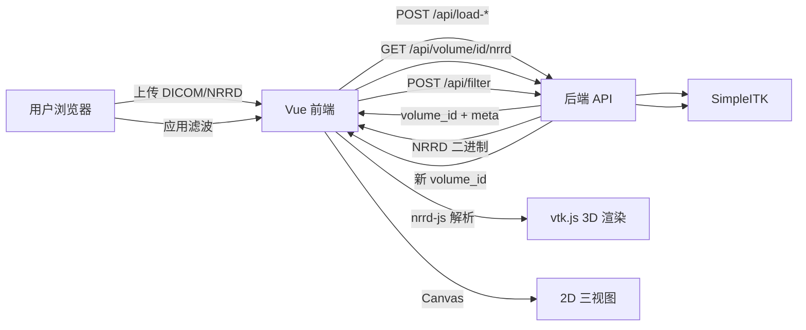

# 项目梳理与架构说明

## 1. 背景

原仓库 `jiqixtxi` 中包含多个实验目录（day2、day3、论文脚本等），结构较乱。本目录 `ct-dicom-viewer` 将 **CT 影像查看与滤波** 相关代码单独提取，形成可独立运行、可嵌入 Spring Boot 的项目。

## 2. 两个版本的关系

| 维度 | 桌面版 (`desktop/`) | 网页版 (`frontend/` + `backend-python/`) |
|------|---------------------|------------------------------------------|
| 入口 | `dicom_viewer_gui.py` | `frontend/src/App.vue` |
| UI 框架 | PyQt5 | Vue 3 + Element Plus |
| 3D 渲染 | VTK + QVTKRenderWindowInteractor | vtk.js (WebGL) |
| 2D 显示 | QLabel + QImage | HTML Canvas |
| 图像 IO / 滤波 | SimpleITK（进程内） | SimpleITK（后端 API） |
| 适用场景 | 本地桌面工具 | 浏览器、Web 集成、Spring Boot |

**注意**：`day2/dicom_viewer_gui.py` 名称含 "gui"，实际是 **PyQt 桌面程序**，不是网页版。网页版在 `day3/web-ct-viewer`，由同一套算法迁移而来。

## 3. 数据流（网页版）



## 4. 核心模块

### 4.1 后端 Python (`backend-python/ct_viewer/`)

| 模块 | 职责 |
|------|------|
| `dicom_io.py` | DICOM 序列读取、NRRD 序列化、元信息 |
| `filters.py` | 7 种滤波算法（与桌面版 `FilterWorker` 一致） |
| `volume_store.py` | 内存体数据缓存（生产环境需替换） |
| `server.py` | Flask REST 路由 |

### 4.2 前端 (`frontend/src/`)

| 文件 | 职责 |
|------|------|
| `App.vue` | 主界面：上传、参数、三视图、3D |
| `components/VtkVolumeViewer.vue` | vtk.js 体渲染与传输函数 |
| `lib/nrrdToVtkImageData.js` | NRRD → vtkImageData |
| `lib/volumeUtils.js` | 窗宽窗位、切片提取、掩码叠加 |
| `lib/apiClient.js` | 后端 API 封装 |

### 4.3 桌面版 (`desktop/`)

单文件 `dicom_viewer_gui.py`，包含：

- `read_dicom_series()` — DICOM 读取
- `FilterWorker` — 后台线程滤波
- `VTKVolumeViewer` — Qt 内嵌 VTK 3D
- `CTFilterWindow` — 主窗口

## 5. 关键算法（前后端一致）

### 窗宽窗位 → 0–255

```
lower = windowCenter - windowWidth / 2
upper = windowCenter + windowWidth / 2
pixel = clip((HU - lower) / (upper - lower) * 255, 0, 255)
```

### 金属伪影掩码

1. HU 阈值二值化
2. 梯度幅值筛选
3. 形态学开/闭运算
4. 连通域分析 + 梯度边缘筛选
5. 输出 0/255 掩码，2D 视图红色叠加

### 3D 传输函数

- 普通 CT：按窗宽窗位设置颜色/透明度曲线
- 掩码：固定红色高亮（255 → 不透明）

## 6. 目录结构

```text
ct-dicom-viewer/
├── README.md
├── .gitignore
├── docs/
│   ├── PROJECT_OVERVIEW.md    # 本文件
│   ├── API.md                 # REST API
│   └── SPRING_BOOT_INTEGRATION.md
├── frontend/                  # Vue 网页前端
├── backend-python/            # Flask 参考后端
└── desktop/                   # PyQt5 桌面版（归档）
```

## 7. 迁移到 Spring Boot 时的分工

| 层 | 技术选型建议 |
|----|-------------|
| 静态前端 | 直接使用 `frontend/dist`，无需改动 |
| REST API | Java Controller 实现 `docs/API.md` 中接口 |
| DICOM 读取 | dcm4che-imageio / weasis-dcm / 调用 Python 服务 |
| 体数据格式 | 统一用 NRRD 或 NIfTI 与前端交换 |
| 滤波 | 移植 `filters.py` 逻辑，或保留 Python 微服务 |
| 会话存储 | 替换内存 `VolumeStore` 为 Redis + 对象存储 |

## 8. 已知限制

- 浏览器上传大 DICOM 文件夹时首次解析较慢
- 当前 `VolumeStore` 为进程内存，重启后 `volume_id` 失效
- NRRD 仅支持内嵌 gzip 数据，不支持外部 data file
- 桌面版依赖 VTK + PyQt5，环境配置较复杂
