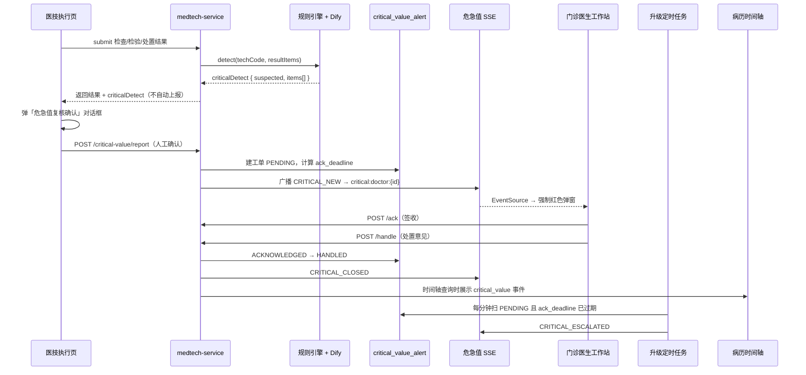

# 危急值闭环管理系统

> 医技出结果 → 规则/AI 识别 → 人工复核上报 → SSE 推送给开单医生 → 强制签收处置 → 超时升级 → 病历时间轴留痕 → 监控看板

本文档介绍熙康云医院平台中**危急值闭环管理系统**的设计目标、业务流程、技术架构与使用说明。该功能收敛在 `medtech-service`（医技服务）与门诊前端，复用了叫号系统已验证的 SSE 推送与定时任务架构。

---

## 1. 背景与目标

### 1.1 临床问题

在真实医疗场景中，检验/检查/处置结果里一旦出现危急值（如血钾极度异常、肌钙蛋白显著升高等），若不能及时通知开单医生并留下处置记录，可能延误救治，也存在质控与医疗纠纷风险。

传统做法往往依赖电话通知或纸质登记，存在：

- 通知不及时、无签收凭证
- 处置过程难以追溯
- 超时无升级机制
- 病历中缺少结构化留痕

### 1.2 系统目标

本系统实现一条完整的**危急值闭环工作流**：

| 阶段 | 能力 |
|------|------|
| 识别 | 规则引擎为主，Dify AI 对影像/文本型结果兜底 |
| 复核 | **不自动上报**，医技人员人工确认后再推送 |
| 通知 | SSE 实时定向推送给开单医生 |
| 签收 | 门诊端全局强制弹窗，不可忽略 |
| 处置 | 医生填写处置意见后闭环 |
| 升级 | 签收超时（默认 10 分钟）自动升级并加强告警 |
| 留痕 | 写入病历时间轴，归档时一并体现 |
| 质控 | 监控看板 + KPI（待签收数、超时率、平均签收/处置时长） |

---

## 2. 端到端业务流程



### 2.1 关键设计原则

1. **疑似不等于上报**：后端仅在结果提交响应中附带 `criticalDetect`，由医技前端弹窗复核，符合制度要求，避免误报骚扰医生。
2. **开单医生解析**：通过 `register.employee_id` 关联接诊医生，不依赖医技申请单上的医生字段。
3. **医生端全局可达**：危急值弹窗挂载在 `AppShell`，医生在任意页面都能收到，而非仅在队列页。
4. **SSE 兜底补拉**：连接建立后调用 `GET /pending`，避免漏推。
5. **单实例 SSE**：与叫号系统一致，多实例部署需后续引入 Redis 转发（本阶段未处理）。

---

## 3. 状态机

工单表 `critical_value_alert.status` 遵循如下状态流转：

```
PENDING ──签收──▶ ACKNOWLEDGED ──处置──▶ HANDLED
   │
   │ ack_deadline 超时（定时任务）
   ▼
ESCALATED ──仍可签收/处置──▶ ACKNOWLEDGED → HANDLED
```

| 状态 | 含义 |
|------|------|
| `PENDING` | 已上报，等待医生签收 |
| `ACKNOWLEDGED` | 医生已签收，等待填写处置意见 |
| `HANDLED` | 处置完成，闭环结束 |
| `ESCALATED` | 签收超时升级，弹窗加强告警样式 |
| `CLOSED` | 预留关闭态（广播 `CRITICAL_CLOSED` 时使用） |

签收时限：**上报时间 + 10 分钟**（`ack_deadline`）。

---

## 4. 数据模型

### 4.1 迁移脚本

| 路径 | 说明 |
|------|------|
| `docker/init-db/migrate_036_critical_value.sql` | Docker 初始化/运维迁移 |
| `medtech-service/src/main/resources/db/migrate_036_critical_value.sql` | 服务内建表脚本副本 |

部署前需执行上述 SQL，创建两张核心表。

### 4.2 `critical_value_alert`（工单表）

记录一次危急值从上报到处置的完整生命周期。

| 字段 | 类型 | 说明 |
|------|------|------|
| `register_id` | BIGINT | 就诊 ID |
| `source_type` | VARCHAR | `inspection` / `check` / `disposal` |
| `source_id` | BIGINT | 对应申请单 ID |
| `tech_name` | VARCHAR | 医技项目名称 |
| `critical_items` | JSONB | 命中危急项明细数组 |
| `severity` | VARCHAR | 严重度，如 `CRITICAL` |
| `reporter_id` / `reporter_name` | | 上报医技人员 |
| `doctor_id` / `doctor_name` | | 开单/接诊医生 |
| `patient_name` / `case_number` | | 患者信息 |
| `status` | VARCHAR | 状态机字段 |
| `reported_time` | TIMESTAMP | 上报时间 |
| `acknowledged_time` | TIMESTAMP | 签收时间 |
| `handled_time` | TIMESTAMP | 处置时间 |
| `handle_note` | VARCHAR | 处置意见 |
| `escalated_time` | TIMESTAMP | 升级时间 |
| `ack_deadline` | TIMESTAMP | 签收截止时间 |

**索引：**

- `(doctor_id, status)` — 医生待签收列表
- `(status, ack_deadline)` — 超时升级扫描
- `(register_id)` — 病历时间轴查询

### 4.3 `critical_value_rule`（阈值规则表）

对结构化检验结果逐项比对危急阈值。预置常见项包括：

| 项目 | field_key | 危急范围（示例） |
|------|-----------|------------------|
| 血钾 | `potassium` | < 2.5 或 > 6.5 mmol/L |
| 血糖 | `glucose` | < 2.2 或 > 22.2 mmol/L |
| 血钙 | `calcium` | < 1.6 或 > 3.5 mmol/L |
| 血钠 | `sodium` | < 120 或 > 160 mmol/L |
| 白细胞 | `wbc` | < 1.0 或 > 30.0 |
| 血小板 | `platelet` | < 20 |
| 血红蛋白 | `hemoglobin` | < 50 g/L |
| 肌钙蛋白 | `troponin` | > 0.5 ng/mL |
| 肌酐 | `creatinine` | > 707 umol/L |
| pH | `ph` | < 7.2 或 > 7.6 |

`tech_code` 支持 `*` 表示全局规则，也可按具体医技编码限定。

---

## 5. 危急值识别

识别器：`medtech-service` → `CriticalValueDetector`

### 5.1 规则引擎（主路径）

对结果数据两个入口进行比对：

1. **`structuredOutput.resultItems`**：模拟检验/结构化输出中的逐项结果
2. **`values`**：动态表单字段键值（与 `critical_value_rule.field_key` 匹配）

命中后返回 `CriticalDetectResult`：

```json
{
  "suspected": true,
  "severity": "CRITICAL",
  "detectSource": "rule",
  "items": [
    {
      "itemName": "血钾",
      "value": "2.1",
      "unit": "mmol/L",
      "referenceRange": "2.5-6.5",
      "rule": "低于危急下限",
      "severity": "CRITICAL",
      "reason": "血钾 2.1mmol/L（低于危急下限）"
    }
  ]
}
```

识别结果通过 `MedtechService` 三个提交接口挂入响应体 `criticalDetect` 字段：

- `PUT /api/medtech/check/result/{id}`
- `PUT /api/medtech/inspection/result/{id}`
- `PUT /api/medtech/disposal/result/{id}`

### 5.2 Dify AI 兜底（可选）

当规则引擎未命中时，对影像描述、自由文本等场景调用 Dify Workflow：

| 配置项 | 环境变量 |
|--------|----------|
| 开关 | `DIFY_WORKFLOW_CRITICAL_VALUE_DETECT` |
| API Key | `DIFY_API_KEY_CRITICAL_VALUE_DETECT` |

配置缺失或调用失败时**静默降级**为「无命中」，不影响正常结果提交。

`application.yml` 片段：

```yaml
xikang:
  ai:
    dify:
      workflow-critical-value-detect: ${DIFY_WORKFLOW_CRITICAL_VALUE_DETECT:}
      api-key-critical-value-detect: ${DIFY_API_KEY_CRITICAL_VALUE_DETECT:}
```

---

## 6. 后端 API

基础路径：`/api/medtech/critical-value`

### 6.1 业务接口

| 方法 | 路径 | 角色 | 说明 |
|------|------|------|------|
| `POST` | `/report` | 医技 / admin | 复核确认后建工单并广播 |
| `GET` | `/pending?doctorId=` | 医生 / admin | 拉取待签收列表（SSE 兜底） |
| `POST` | `/{id}/ack` | 医生 / admin | 签收 |
| `POST` | `/{id}/handle` | 医生 / admin | 提交处置意见 |
| `GET` | `/board` | 医技 / admin | 看板列表 + KPI 统计 |

#### 上报请求体示例

```json
{
  "registerId": 1001,
  "sourceType": "inspection",
  "sourceId": 88,
  "techName": "血常规",
  "severity": "CRITICAL",
  "items": [
    {
      "itemName": "血钾",
      "value": "2.1",
      "unit": "mmol/L",
      "referenceRange": "2.5-6.5",
      "severity": "CRITICAL"
    }
  ]
}
```

#### 处置请求体示例

```json
{
  "handleNote": "已电话通知患者返院，安排急诊复查血钾并补钾治疗。"
}
```

### 6.2 SSE 订阅端点

| 方法 | 路径 | 订阅方 |
|------|------|--------|
| `GET` | `/stream/doctor/{doctorId}` | 门诊医生工作站 |
| `GET` | `/stream/board` | 危急值监控看板 |

**事件类型：**

| 事件名 | 触发时机 |
|--------|----------|
| `READY` | 连接建立 |
| `HEARTBEAT` | 每 30 秒心跳 |
| `CRITICAL_NEW` | 新工单上报 |
| `CRITICAL_ESCALATED` | 签收超时升级 |
| `CRITICAL_CLOSED` | 处置完成 |

**Topic 规则：**

- 医生：`critical:doctor:{doctorId}`
- 看板：`critical:board`

网关 JWT 白名单已包含 `/critical-value/stream/`，与叫号 SSE 一致，避免 EventSource 无法携带 Token 的问题。

### 6.3 鉴权说明

危急值接口使用独立拦截器 `CriticalValueAuthInterceptor`，与医技执行接口的 `MedtechAuthInterceptor` 分离：

- 医技角色：`/report`、`/board`
- 医生角色：`/pending`、`/ack`、`/handle`（需 `employeeId` 与工单 `doctor_id` 一致）
- admin：全部放行
- SSE stream：不拦截（公共订阅，与叫号一致）

`/api/medtech/critical-value/**` 已从医技拦截器中排除，避免医生角色被误拦。

### 6.4 超时升级任务

`CriticalValueEscalationScheduler`：

- Cron：`0 * * * * *`（每分钟）
- 条件：`status = PENDING AND ack_deadline < now()`
- 动作：更新为 `ESCALATED`，广播 `CRITICAL_ESCALATED`

需在 `MedtechApplication` 上启用 `@EnableScheduling`。

---

## 7. 病历时间轴留痕

处置完成后，工单数据存入 `critical_value_alert`。门诊 `physician-service` 在拼装就诊时间轴时，通过 `ClinicalRecordMapper.selectCriticalValueAlerts(registerId)` 查询并生成事件：

| 字段 | 值 |
|------|-----|
| `eventType` | `critical_value` |
| `title` | 危急值闭环 |
| `summary` | 项目名称 + 处置意见 |
| `status` | `pending` / `escalated` / `completed` |
| `sourceType` | `critical_value_alert` |

前端 `EncounterProgressCard` 已注册该事件类型的图标与步骤索引（归入「结果」阶段）。

---

## 8. 前端功能说明

### 8.1 文件结构

```
xikang-hospital-frontend/src/
├── shared/
│   ├── api/modules/criticalValue.ts          # API 封装
│   ├── composables/
│   │   ├── useCriticalValueReport.ts         # 医技复核上报流程
│   │   └── useCriticalValueStream.ts         # 医生 SSE 订阅
│   └── components/
│       ├── CriticalValueConfirmDialog.vue    # 医技复核弹窗
│       └── CriticalValueAlertDialog.vue      # 医生强制签收弹窗
├── modules/medtech/pages/
│   ├── MedtechCheckStartPage.vue             # 检查执行（已接入）
│   ├── MedtechInspectionStartPage.vue        # 检验执行（已接入）
│   ├── MedtechDisposalStartPage.vue          # 处置执行（已接入）
│   └── CriticalValueBoardPage.vue            # 监控看板
└── app/layouts/AppShell.vue                  # 医生端全局弹窗挂载点
```

### 8.2 医技端流程

1. 医技人员在执行页填写结果并提交
2. 若响应 `criticalDetect.suspected === true`，弹出**危急值复核确认**对话框
3. 展示命中项、结果值、参考范围、严重度
4. 医技人员选择：
   - **确认上报** → 调用 `criticalValueApi.report()`
   - **非危急值，跳过** → 不上报，正常返回列表

### 8.3 门诊医生端流程

1. `AppShell` 在 `role === physician'` 时启动 SSE 订阅（`employeeId` 作为 doctorId）
2. 收到 `CRITICAL_NEW` 或 `CRITICAL_ESCALATED` 后弹出**强制签收**对话框：
   - 红色告警样式，不可点击遮罩关闭
   - 展示患者、危急项、签收倒计时
   - 升级态（`ESCALATED`）边框加强闪烁
   - 间歇告警音
3. 两步操作：
   - 第一步：**我已知晓，签收** → `ack`
   - 第二步：填写**处置意见**（必填）→ `handle`
4. 连接建立后自动 `GET /pending` 补拉历史未签收工单

### 8.4 监控看板

路由：`/medtech/critical-value-board`（医技 / admin 可见）

功能：

- KPI 卡片：待签收数、已升级数、超时率、平均签收时长、平均处置时长
- 实时工单列表（未签收高亮、超时红闪）
- 订阅 `/stream/board` 实时刷新

---

## 9. 部署与配置

### 9.1 数据库

```bash
# 在 PostgreSQL 中执行
psql -U <user> -d <database> -f docker/init-db/migrate_036_critical_value.sql
```

### 9.2 服务依赖

- `medtech-service`：核心逻辑 + SSE + 定时任务
- `physician-service`：病历时间轴查询
- `gateway-service`：JWT 白名单 `/critical-value/stream/`

### 9.3 可选 Dify 配置

```env
DIFY_ENABLED=true
DIFY_BASE_URL=http://your-dify-host
DIFY_WORKFLOW_CRITICAL_VALUE_DETECT=true
DIFY_API_KEY_CRITICAL_VALUE_DETECT=app-xxxxxxxx
```

未配置时仅使用规则引擎，不影响主流程。

### 9.4 联调验证清单

| 步骤 | 操作 | 预期 |
|------|------|------|
| 1 | 医技提交含低血钾值的检验结果 | 弹出复核对话框 |
| 2 | 确认上报 | 医生端收到红色弹窗 |
| 3 | 医生签收并填写处置 | 弹窗关闭，工单状态 HANDLED |
| 4 | 查看就诊时间轴 | 出现「危急值闭环」事件 |
| 5 | 上报后等待 10 分钟不签收 | 状态变 ESCALATED，弹窗升级样式 |
| 6 | 打开 `/medtech/critical-value-board` | KPI 与列表实时更新 |

---

## 10. 架构复用说明

本功能刻意复用项目中已验证的基建，降低实现风险：

| 能力 | 参考实现 |
|------|----------|
| SSE 三件套 | `registration-service` 叫号系统（`CallingSubscriberRegistry` / `Broadcaster` / `StreamController`） |
| 超时定时任务 | `CallingTimeoutScheduler` |
| Dify 调用 | `DifyWorkflowClient` + `DifyAiProperties` |
| 医生身份 | `authStore.employeeId` |
| 结果提交挂载扩展字段 | `MedtechService.submit*Result` 返回 `Map` |

---

## 11. 已知限制与后续扩展

| 限制 | 说明 |
|------|------|
| SSE 单实例 | 多实例部署需 Redis Pub/Sub 转发，当前与叫号一致 |
| 开单医生为空 | 若 `register.employee_id` 为空，上报接口返回 400 |
| SSE 无鉴权 | 与叫号大屏相同，知晓 doctorId 即可订阅（内网场景可接受） |
| 规则维护 | 当前通过 SQL 种子 + 表维护，后续可做管理界面 |

**可扩展方向：**

- 升级后推送给科室主任或值班医生
- 危急值规则可视化配置
- 与 HIS/LIS 外部系统对接
- 多实例 SSE 集群化

---

## 12. 相关代码索引

### 后端（medtech-service）

| 模块 | 路径 |
|------|------|
| 识别器 | `ai/CriticalValueDetector.java` |
| 业务服务 | `service/CriticalValueService.java` |
| REST API | `controller/CriticalValueController.java` |
| SSE | `sse/CriticalValueSubscriberRegistry.java`、`sse/CriticalValueBroadcaster.java` |
| SSE 端点 | `controller/CriticalValueStreamController.java` |
| 升级任务 | `scheduler/CriticalValueEscalationScheduler.java` |
| 鉴权 | `config/CriticalValueAuthInterceptor.java` |
| 开单医生解析 | `mapper/CriticalValueContextMapper.xml` |

### 后端（physician-service）

| 模块 | 路径 |
|------|------|
| 时间轴拼装 | `service/ClinicalRecordService.java` |
| 工单查询 | `mapper/ClinicalRecordMapper.xml` → `selectCriticalValueAlerts` |

### 前端

| 模块 | 路径 |
|------|------|
| API | `shared/api/modules/criticalValue.ts` |
| 医技复核 | `shared/composables/useCriticalValueReport.ts` |
| 医生订阅 | `shared/composables/useCriticalValueStream.ts` |
| 全局弹窗 | `app/layouts/AppShell.vue` |
| 看板页 | `modules/medtech/pages/CriticalValueBoardPage.vue` |
| 路由 | `app/router/routes.ts` → `critical-value-board` |

---

*文档版本：与 migrate_036 及四阶段实现计划对齐。*
